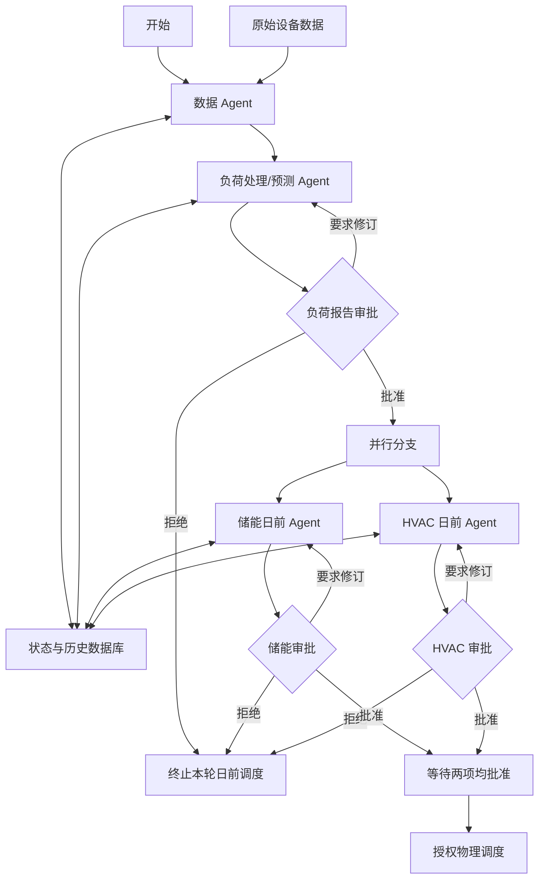
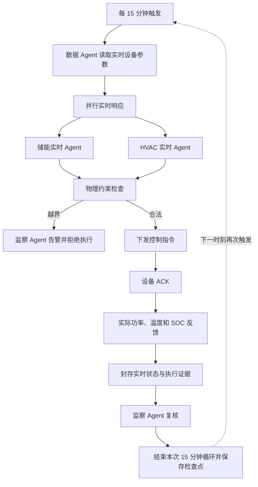

# 黄花园区能源管理系统 LangGraph 忠实化改造指南

版本日期：2026-08-03  
适用项目：`energy_management_v3/v3_energy_management`  
文档状态：**唯一有效的工程改造指南**  
文档用途：作为确定性控制内核、受控多 Agent 协同层、LangGraph 架构改造、页面拓扑对齐和验收测试的统一依据。

本文件是 v3 修改、重构、审查和验收的唯一规范性指南。`ARCHITECTURE.md` 只描述当前已实现状态；其他 roadmap、审计或讨论文档只作为历史参考，不得单独定义与本文件冲突的目标、权限、接口或完成标准。发生冲突时，以本文件中的物理安全、审批绑定、状态恢复和执行顺序为准。

## 1. 改造结论

当前系统实现了日前数据处理、三道工程师审批、储能与 HVAC 优化、物理执行、实时反馈、数据封存和监察等主要功能，但后端实际执行的 LangGraph 尚未忠实反映原始设计图。

本次改造的核心目标是：

1. 后端只维护一套真实可执行的 LangGraph；前端流程图必须从真实执行图生成。
2. 日前负荷审批通过后，储能和 HVAC 形成真正的并行分支。
3. 每个审批门都具备批准、要求修订、拒绝三条明确路径。
4. 储能和 HVAC 的实时响应、物理校验、命令、ACK、反馈、封存和监察形成可恢复的 15 分钟循环。
5. 数据库、Agent 状态、物理知识约束和运行证据具有清晰的数据接口与持久化位置。
6. GLM 负责理解目标、解释事实和提出事件草案，不拥有算法数值、审批权或直接执行权。
7. 多 Agent 层通过版本化快照、结构化任务、最小权限工具、确定性安全门和人工审批协同工作，不直接修改控制状态。

### 1.1 实施路径判断

V3 应采用：**先完成可执行且唯一的 LangGraph 架构，再接入现有运行引擎和 FastAPI；部署时仍由后端直接承载。**

> **LangGraph 独立开发成一个完整模块，但现阶段与 FastAPI 一起部署。**

这里的“先做架构”不是先画静态流程图，而是先完成状态契约、日前子图、实时子图、审批路由、检查点和自动化测试。验证通过后，再由 `SimulationEngine` 通过 `start_day()`、`resume_approval()`、`run_tick()` 等稳定接口调用，FastAPI 只负责请求适配和状态查询。

不建议继续在现有后端逻辑中边运行边补图节点。当前展示拓扑、执行图和 `SimulationEngine` 图外状态并存，直接叠加会扩大双重状态源。现阶段也无需拆成 LangGraph 微服务；单园区试运行继续采用单后端、单调度实例，出现多园区、独立扩缩容或高可用需求后再拆分执行 Worker。

> 核心原则：**实施上先架构后接入，部署上仍直接搭载后端。**

### 1.2 面向非软件背景的说明

可以把系统理解为一条经过人工把关的能源决策流水线：

```text
前端操作台 → FastAPI 接收请求 → LangGraph 组织流程
→ 专业算法计算方案 → 工程师审批 → 模拟设备执行
→ 实时反馈、监察和封存
```

当前架构中，前端负责展示和操作，FastAPI 负责对外通信，`SimulationEngine` 负责仿真时钟和运行状态，LangGraph 已负责部分日前流程，MILP 等确定性算法负责计算，GLM 只负责理解和解释，执行器与归档模块负责命令、反馈和留痕。当前主要问题是 15 分钟实时循环和部分审批状态仍在 LangGraph 图外，且前端展示图与后端执行图分别维护。

开发这个系统最需要的不是增加更多大模型，而是三项可靠基础：

1. 厂务工程师确认的业务规则和设备安全边界；
2. 连续、可信且可追溯的真实数据；
3. 一套能够恢复、测试和审计的唯一执行流程。

就当前软件改造而言，最优先任务是把现有流程统一成一套真实可执行的 LangGraph，并用自动化测试证明审批、执行、反馈和异常恢复都符合规则。

### 1.3 本文档的执行级别

本文档是 v3 代码修改与重构的工程规范，而不是概念建议。后续开发、代码审查和验收统一使用以下术语：

- **必须（MUST）**：不满足即不得合并、不得进入下一阶段；
- **应该（SHOULD）**：原则上执行，若偏离必须在变更记录中说明原因和替代保障；
- **可以（MAY）**：不影响正确性的可选实现。

每项改造必须同时给出：目标模块、稳定 interface、状态读写范围、错误路径、自动化测试和回滚方式。仅完成页面展示、仅增加类或文件、仅让演示路径跑通，都不能视为完成。

## 2. 当前架构位置

当前 V3 项目根目录：

```text
D:\ZBY_synchronization\【博士】其他项目\碳中和实践\energy_management_v3\v3_energy_management
```

主要架构文件：

| 内容 | 当前文件 |
| --- | --- |
| 可执行 LangGraph 与前端静态拓扑 | `backend/src/graph/workflow.py` |
| 各 Agent 节点处理逻辑 | `backend/src/agents/engine.py` |
| LangGraph 状态契约 | `backend/src/core/state.py` |
| 15 分钟实时执行循环 | `backend/src/agents/engine.py::_update_realtime_locked` |
| 物理命令、ACK 和测量反馈 | `backend/src/core/executor.py` |
| 报告、审批、命令和实时数据封存 | `backend/src/core/archive.py` |
| Agent 大语言模型角色配置 | `backend/agents_config/*.md` |
| 前端 Agent 流程页面 | `frontend/src/pages/AgentFlow.tsx` |
| 当前架构说明 | `docs/ARCHITECTURE.md` |

当前 `workflow.py` 同时保存了两套图：

- `GRAPH_NODES`、`GRAPH_EDGES`：供前端展示；
- `build_energy_workflow()`：后端真正执行。

两套定义分别维护，是前端流程图与实际 LangGraph 不一致的直接原因。

## 3. 当前设计依据与偏差来源

V3 初始版本的代码注释写明“对齐 `guide.md` 中的 Mermaid 图”，最初只创建了静态拓扑。当前仓库已不存在该 `guide.md`，因此原始设计依据没有被完整保存。

后续版本新增了真正可执行的 `StateGraph`，重点转向以下安全规则：

- 三道审批门；
- 未审批或已拒绝的策略不得进入物理执行；
- 调度指令绑定报告 ID 与 SHA-256 哈希；
- 工作流按阶段暂停和恢复；
- 15 分钟实时执行、ACK、反馈和追加式封存；
- GLM 只解释已验证事实，不直接改变算法结果。

上述设计增强了安全性，但在落地时简化了原始设计中的并行分支、审批退回、实时循环、数据库双向交互和监察旁路，因此需要本次忠实化改造。

### 3.1 已确认差距与强制改造指令

以下五项已经通过当前代码确认，是本次重构必须消除的结构性差距：

| 编号 | 当前证据 | 目标状态 | 强制改造指令 | 完成判据 |
|---|---|---|---|---|
| `G1` 双图定义 | `graph/workflow.py` 同时存在 `GRAPH_NODES/GRAPH_EDGES`、`get_graph_topology()` 和 `build_energy_workflow()` | 执行图与展示图来自同一份节点、边和路由定义 | **必须**建立唯一 `WorkflowSpec`；编译 LangGraph 和导出前端拓扑均读取该定义；迁移完成后删除独立静态图定义 | 修改任一节点或边时，执行图和 `/api/graph` 同步变化；仓库中不存在第二份可独立编辑的拓扑 |
| `G2` 日前串行 | `build_energy_workflow()` 当前为 `run_storage_agent → run_hvac_agent → open_dispatch_gates` | 负荷审批通过后，储能与 HVAC 并行计算并分别审批 | **必须**建立并行分支和双审批汇合；分支分别写入独立状态区域；任一分支修订不得重算另一分支 | 测试证明两个分支无固定先后依赖，且两项均批准前不能授权物理调度 |
| `G3` 实时逻辑在图外 | `SimulationEngine._update_realtime_locked()` 同时承担读数、设定值修正、执行、ACK、反馈、指标和告警 | 每次 15 分钟 Tick 是可测试、可检查点恢复的实时子图 | **必须**把一次 Tick 拆为实时数据、储能/HVAC响应、安全检查、执行、ACK、反馈、封存和监察节点；一次调用只处理一个 `step` | 每个 Tick 有唯一幂等键和完整证据；重放不会重复下发已经成功 ACK 的命令 |
| `G4` 归档不可恢复 | `ArchiveStore` 只提供追加事件和 CSV 写入，没有 `load/save` 当前运行状态的 interface | 审计归档与可恢复状态职责分离 | **必须**新增 `StateRepository` seam，并提供内存测试 Adapter 与文件/SQLite运行 Adapter；`ArchiveStore` 继续只承担不可变证据 | 服务重启后可恢复审批点或实时检查点；恢复过程不依赖扫描并猜测全部归档文件 |
| `G5` GLM 只有一轮工具交互 | `FacilityChatService.chat()` 执行一次 `tool_calls` 后再次调用 GLM 并直接结束，`coordinate_agents()` 仍返回模板化结论 | 复杂目标由 `MissionRuntime` 动态派发专业 Agent，并在有界预算内分析、暂停和恢复 | **必须**在 `G1–G4` 稳定后建立受控多 Agent 协同层；`AgentRunLoop` 只作为专业 Agent 内部实现，聊天模块不得自行维护循环细节 | 专业 Agent 基于同一快照并行分析；重复、超时、预算、陈旧快照和审批均能安全停止；GLM永远没有审批与控制工具 |

### 3.2 改造依赖顺序

五项改造不得随意并行穿插，依赖关系如下：

```text
基线与安全测试
→ G1 唯一工作流定义
→ G2 日前并行与审批路由
→ G3 单 Tick 实时子图
→ G4 状态仓库与重启恢复
→ 前端切换到真实拓扑和检查点
→ G5 多轮 Agent 循环
```

`G1–G4` 任一工程门未通过时，不得开始开放 `PROPOSE` 级多轮 Agent 能力。原因是 Agent 循环只能消费稳定的事实和工具 interface，不能用于掩盖工作流状态不一致。

## 4. 改造原则

### 4.1 单一真实来源

节点、边、条件路由和节点说明只能在后端可执行图中定义一次。前端通过后端接口读取编译后的真实拓扑，不再手工维护第二套 `GRAPH_NODES/GRAPH_EDGES`。

### 4.2 日前与实时分图

将系统划分为两个相互连接的深模块：

- 日前规划子图：数据、负荷处理/预测、审批、储能与 HVAC 优化、物理调度授权；
- 实时控制子图：实时数据、设备响应、安全校验、命令、ACK、反馈、封存和监察。

每个模块对外只提供少量接口，内部隐藏节点调度、状态合并和异常处理细节。

### 4.3 一次实时调用只处理一个时刻

不得在服务器请求中运行永不停止的死循环。每次实时图只处理一个 15 分钟时刻，完成后保存检查点并结束；时间引擎在下一时刻再次恢复运行。

### 4.4 所有副作用前必须经过安全门

任何物理指令都必须依次满足：

1. 对应日前调度已经批准；
2. 报告 ID 与哈希仍然有效；
3. 实时设定值通过 SOC、温度、功率、供回水温度、COP 等物理约束；
4. 监察节点没有阻断执行。

## 5. 日前规划与审批子图



### 5.1 必须实现的路由规则

1. 负荷报告批准后，储能和 HVAC 必须并行计算，而不是依次运行。
2. 负荷报告要求修订时，返回负荷处理/预测 Agent，并使下游旧报告失效。
3. 储能报告要求修订时，只返回储能 Agent，不重复计算 HVAC。
4. HVAC 报告要求修订时，只返回 HVAC Agent，不重复计算储能。
5. 任一报告拒绝时，终止本轮日前物理授权。
6. 两项调度报告都批准后才能进入物理调度授权节点。
7. 每次重新生成报告时必须产生新的报告 ID 和哈希，旧审批不得继续使用。

### 5.2 储能仿真口径

1. 新一天的起始 SOC 继承前一天最后一次实际反馈 SOC；只有系统主动 `reset` 时回到 50%。
2. 充电效率和放电效率均按 90% 计算。
3. 日前优化默认只计算日电度电费，不把月度需量电费计入每日收益；需量优化应由后续月度协调器单独处理。
4. 每次充电/放电模式转换默认计入 10 元惩罚，用于减少同价值方案中的无意义频繁切换，该参数必须可配置。
5. 默认末端 SOC 等于当天起始 SOC，避免把消耗期初库存误报为收益。

## 6. 实时控制子图



### 6.1 储能实时 Agent

输入：

- 日前储能计划；
- 实时负荷、光伏、电价；
- 实际 SOC、电芯温度、上一步功率；
- 人工覆盖或厂务确认事件；
- 储能物理约束配置。

输出：

- 本时刻储能功率设定值；
- 调整原因；
- 约束检查结果；
- 需要告警或重新规划的标志。

### 6.2 HVAC 实时 Agent

输入：

- 日前 HVAC 计划；
- 实时冷负荷、室外温湿度；
- 冷机可用状态；
- 实际功率和供回水温度；
- 人工覆盖或厂务确认事件；
- HVAC 物理约束配置。

输出：

- 本时刻 HVAC 功率或供水温度设定值；
- 调整原因；
- 约束检查结果；
- 需要告警或重新规划的标志。

## 7. 扰动与人工输入循环

厂务或工程师输入分为两类：

### 7.1 实时小幅修正

在已批准计划和物理安全范围内的功率、温度修正：

```text
自然语言目标
→ GLM 解析为结构化控制草案
→ 人工确认
→ 下一实时步进入储能/HVAC实时Agent
→ 安全校验
→ 执行、反馈、封存
```

该路径不改变日前报告，但必须保留操作者、原因、原设定值、新设定值、命令、ACK 和反馈。

### 7.2 实质性扰动

负荷、排班、天气、电价、设备故障或可用容量发生实质变化：

```text
事件草案
→ 人工确认
→ 旧下游报告失效
→ 数据Agent重新汇总
→ 负荷处理/预测重新计算
→ 重新进入日前审批链
```

不得在未重新审批的情况下继续使用已经失效的下游调度报告。

## 8. 监察 Agent 的正确位置

原始设计中的虚线监察关系不能只作为前端装饰。监察必须转化为可执行行为：

1. 每个 Agent 节点完成后检查输出完整性、时间戳、报告哈希和物理含义。
2. 每个物理命令下发前检查审批状态和安全约束。
3. 每次设备反馈后检查执行偏差、SOC、温度、供回水温度和设备可用性。
4. 每次数据封存后检查写入结果和可追溯性。
5. 另设独立健康检查，监察时间引擎、WebSocket、数据库和设备适配器心跳。

监察 Agent 可以批准“检查通过”，但不能替代工程师做业务审批。

## 9. Agent 状态与物理知识配置

“每个 Agent 一个状态文件”应拆分为固定知识和运行状态两类，避免多个并行 Agent 直接覆盖同一个普通文件。

### 9.1 固定知识配置

建议目录：

```text
backend/config/agents/
├── data.yaml
├── prediction.yaml
├── storage.yaml
├── hvac.yaml
└── monitor.yaml
```

储能配置示例：

```yaml
soc_min: 0.10
soc_max: 0.90
temperature_max_c: 45
charge_power_max_kw: 15000
discharge_power_max_kw: 15000
ramp_limit_kw_per_step: 3000
```

HVAC 配置示例：

```yaml
supply_temp_min_c: 5
supply_temp_max_c: 12
return_temp_max_c: 18
minimum_cop: 3.0
minimum_available_chillers: 1
```

配置文件必须带版本号，报告和命令中保存所使用的配置版本。

### 9.2 运行状态

运行状态通过统一状态仓库保存，并按照 `run_id` 和 Agent 切分：

```text
run_id
├── data_agent_state
├── prediction_agent_state
├── storage_agent_state
├── hvac_agent_state
├── monitor_agent_state
├── approval_state
└── physical_execution_state
```

每个 Agent 只能修改自己的状态区域；监察 Agent 以只读方式检查所有区域。测试环境使用内存适配器，当前演示环境可以继续使用文件适配器，未来接入真实系统时再增加 SQLite/PostgreSQL 适配器。

## 10. 受控多 Agent 治理与有界协同

### 10.1 当前状态、目标与非目标

当前厂务聊天链已经具备 Tool Schema、Function Calling、工具执行和工具结果回传，但一次请求只完成一轮工具交互，`coordinate_agents()` 仍主要返回模板化专业结论，会话历史也只保存在进程内存。因此，当前系统是“带工具的协同助手”，尚不是可暂停、恢复、审计和动态派发的受控多 Agent 系统。

目标架构必须保持：

> **受控多 Agent 协同层 + 确定性能源控制内核。**

多 Agent 层负责理解目标、拆分任务、调用确定性分析工具、比较方案、识别冲突、解释风险和生成候选建议；确定性内核继续负责数据处理、优化求解、物理约束、审批绑定、设备执行、ACK、反馈和审计。

第一版所有 Agent 在同一个 Python 进程内异步运行。只有出现独立扩缩容、权限隔离或故障隔离的真实需求后，才评估远程 Worker；不得为了“多 Agent”概念提前拆成微服务。

明确非目标：

- 不让 LLM 自行生成负荷曲线、储能功率、HVAC设定值、节费金额或碳排结果；
- 不向 Agent 暴露 `APPROVE`、`CONTROL` 或修改安全阈值的工具；
- 不用 Agent 替代 MILP、HVAC调度、负荷重采样、物理约束和设备执行器；
- 不把完整聊天记录广播给所有 Agent；
- 不把追加式审计归档直接当作可恢复运行状态；
- 不让一次 Mission 人工确认替代负荷、储能和 HVAC 原有业务审批。

### 10.2 何时使用 Agent

只有同时具备“目标驱动、动态选择工具、需要多步分析、可能出现跨专业冲突”的任务才进入受控 Agent 协同：

```text
固定输入 → 固定算法 → 固定输出       = 确定性模块
目标 → 观察 → 选择工具 → 复核 → 输出 = Agent Mission
```

适用场景：

1. 设备故障后的跨数据、储能、HVAC联合分析；
2. 调度未生效时对报告、审批、命令、ACK和反馈的多步诊断；
3. 需量、成本、碳排、舒适度和设备边界的多目标方案比较；
4. 数据缺失、模型结论冲突或快照陈旧时的定向复核；
5. 需要人工补充信息、暂停后恢复验证的长任务。

不适用场景：单一状态查询、一次确定性计算、15分钟实时控制、设备联锁、ACK采集和安全约束执行。这些继续由普通模块和确定性工作流完成。

### 10.3 Agent 划分与职责

| 模块 | 形态 | 主要输出 | 禁止事项 |
|---|---|---|---|
| Coordinator | Agent | 结构化任务计划、选中 Agent、预算和完成条件 | 不生成算法数值、不执行控制 |
| Data Agent | 只读 Agent | 数据质量结论、血缘证据、阻塞项 | 不修改原始数据、不伪造实测值 |
| Prediction | 确定性模块 | 负荷校验与能量守恒重采样结果 | 无版本化预测模型前不得宣称预测未来 |
| Storage Agent | 分析 Agent | 候选储能策略、风险和证据 | 不写入正式计划、不发送功率指令 |
| HVAC Agent | 分析 Agent | 候选HVAC策略、容量风险和证据 | 不修改正式设定值、不发送命令 |
| Aggregator | 确定性优先的深模块 | 冲突清单和联合候选方案 | 不掩盖冲突、不凭自由文本选择数值 |
| Risk Agent | 审查 Agent | 跨专业风险解释、缺失证据和复核建议 | 不拥有硬安全结论、不覆盖 Safety Kernel |
| Safety Kernel | 确定性模块 | `pass/reject/stale_snapshot` 和违规项 | 不调用 LLM、不软化硬约束 |
| Monitor Agent | 运行监察模块 | 节点完整性、命令前检查、ACK/反馈偏差和健康告警 | 不替代业务审批、不被 Risk Agent 取代 |
| Physical Dispatch | 确定性模块 | 命令、ACK和实测反馈 | 不接受 Agent 自由文本作为命令 |

Risk、Safety和Monitor职责必须同时存在：Risk负责执行前的语义风险解释，Safety负责不可绕过的确定性硬约束，Monitor负责节点完成后、命令前、反馈后和系统健康检查。

### 10.4 标识符、快照、上下文与记忆

统一标识符：

| 标识符 | 含义 | 生命周期 |
|---|---|---|
| `session_id` | 人与系统的聊天会话 | 可跨多个 Mission |
| `mission_id` | 一次目标驱动的多 Agent 协作任务 | 从目标创建到完成、取消或失败 |
| `task_id` | Coordinator 派给一个专业 Agent 的任务 | 单次执行或定向复核 |
| `snapshot_id` | 某一时刻不可变的系统事实版本 | 永久可追溯 |
| `run_id` | 一轮日前计划或实时控制运行 | 与审批、报告和执行证据绑定 |

一个 Mission 可以只分析而没有 `run_id`，也可以在扰动重算后关联一个或多个 `run_id`。不得用 `session_id` 或 `mission_id` 代替控制运行标识。

同一 Mission 内并行专业 Agent 必须读取同一个 `snapshot_id`，不得直接读取持续变化的 `SimulationEngine` 可变对象。若联合方案提交时当前状态版本已变化，Safety Kernel必须返回 `stale_snapshot`，由 Coordinator基于新快照重算或请求人工决定。

每个 Agent 的上下文按五层构建：

1. 固定政策：角色、权限、禁止事项和输出 Schema；
2. 任务包：目标、完成条件、允许工具、预算和截止时间；
3. 共享事实：同一 `snapshot_id` 下的最小必要数据切片；
4. 私有任务记忆：该 Agent 最近任务、结果和人工反馈的结构化摘要；
5. 协作输入：Coordinator明确转交的其他 Agent 结果或冲突。

允许写入长期记忆的只有经确认的稳定设备事实、已执行方案的真实反馈、明确人工意见和重复失败模式。未审批候选方案、模型推测、密钥、隐私、完整聊天副本和可从快照重读的大型时间序列不得写入。

### 10.5 深模块与稳定 interface

聊天层只调用 Mission seam：

```python
start(goal, actor, role, session_id) -> MissionResult
resume(mission_id, human_input) -> MissionResult
get(mission_id) -> MissionView
```

专业 Agent 统一满足：

```python
class EnergyAgent(Protocol):
    async def run(
        self,
        task: AgentTask,
        context: AgentContext,
    ) -> AgentResult: ...
```

其他关键 seam：

```python
ContextBroker.build(agent_id, task, snapshot_ref) -> AgentContext
SafetyKernel.validate(proposal, current_snapshot_ref) -> SafetyVerdict
StateRepository.load/save/append_event(...)
```

`AgentRunLoop` 可以作为专业 Agent 内部实现，隐藏提示词、工具选择、预算、重试和上下文裁剪；它不是顶层协同入口。`FacilityChatService` 只负责聊天记录、身份适配、调用 `MissionRuntime` 和确定性降级，不得自行维护多轮 `while`。

核心结构化契约至少包括：

- `OperationalSnapshot`：`snapshot_id/as_of/schema_version/provenance`；
- `AgentTask`：`task_id/mission_id/objective/snapshot_ref/required_outputs/allowed_tools/budget`；
- `AgentResult`：状态、发现、建议、证据、假设、风险、置信度和 `snapshot_id`；
- `JointProposal`：候选动作、来源任务、冲突和所需审批；
- `SafetyVerdict`：`pass/reject/stale_snapshot`、违规项和校验快照；
- `MissionState`：计划、结果引用、预算、暂停原因、人工决定和关联 `run_id`。

Agent之间不得用自由文本传递机器决策所需的关键字段；自然语言只用于人员解释。

### 10.6 目标 Mission 执行图与控制桥接

```text
START
→ capture_snapshot
→ coordinator_plan
→ dynamic fan-out：选中的专业 Agent
→ aggregate_results
→ [存在可解决冲突] targeted_review（最多一轮）
→ risk_review
→ safety_precheck
→ [reject/stale] replan、请求信息或安全结束
→ [pass] interrupt：人工确认候选方案
→ capture_current_snapshot
→ safety_revalidate_after_approval
→ [reject/stale] 返回人工或重新规划
→ [pass] proposal_bridge
→ 现有确定性扰动/控制/日前工作流
→ 现有负荷、储能和 HVAC 审批
→ 执行前最终绑定与物理校验
→ Physical Dispatch
→ ACK 与测量反馈
→ verify_feedback
→ END
```

人工确认候选方案只表示“允许把建议交给现有领域工作流”，不能替代三道业务审批。人工等待后必须重新捕获当前快照并再次运行 Safety Kernel；旧快照上的通过结论不得直接用于执行。

`JointProposal` 只允许以下枚举化动作：

| 动作 | 进入的确定性路径 |
|---|---|
| `analysis_only` | 只生成分析结果，不改变状态 |
| `request_human_information` | 暂停 Mission，等待补充信息 |
| `propose_disturbance` | 创建 `DisturbanceEvent(status="proposed")`，等待现有决定 interface |
| `propose_control_action` | 创建待批准 `ControlActionRecord`，下一 Tick 前仍需安全校验 |
| `request_replan` | 使相关旧报告失效并重新进入日前工作流 |

任何自由文本不得直接转换为设备命令。`proposal_bridge` 只能调用上述受控领域 interface，不能调用执行器。

### 10.7 Tool Registry 与最小权限

工具按五级管理：

| 权限级别 | 示例 | Agent 权限 |
|---|---|---|
| `READ` | 快照、报告、审批、告警、ACK、反馈 | 按 Agent 数据切片自动执行 |
| `ANALYZE` | 数据质量、储能/HVAC隔离情景、约束预检查 | 按任务白名单自动执行；数值来自确定性算法 |
| `PROPOSE` | 扰动、控制动作或重算草案 | 可以创建草案，随后必须暂停 |
| `APPROVE` | 批准报告、应用扰动 | 仅授权人员，禁止注册给 Agent |
| `CONTROL` | 物理命令、修改安全阈值 | 禁止注册给 Agent |

Tool Registry必须同时校验 Agent身份、人员角色、`mission_id/task_id`、快照、任务范围、参数 Schema、调用预算和重复调用。权限校验必须在执行前由代码完成，不能依赖模型遵守提示词。

当前工具可归类为：

- `get_system_snapshot`：`READ`；
- `list_disturbances`：`READ`；
- `coordinate_energy_agents`：当前模板兼容入口，迁移后由 `MissionRuntime` 替代；
- `propose_disturbance`：`PROPOSE`。

后续可增加 `get_agent_report`、`get_approval_status`、`get_command_ack_trace`、`get_realtime_deviation`、`run_scenario_analysis`、`validate_dispatch_constraints` 和 `compare_dispatch_scenarios`。这些工具必须读取确定性状态或隔离情景，不能让 GLM生成算法数值。

### 10.8 有界执行、暂停、恢复与持久化

第一版单个 Mission 建议限制：

```yaml
max_model_steps: 8
max_tool_calls: 16
max_targeted_reviews: 1
max_same_call_repeats: 2
timeout_seconds: 120
stop_on_proposal_or_approval: true
```

Mission必须在完成、等待人工、缺少信息、越权、陈旧快照、重复调用、预算耗尽、超时、取消或工具连续失败时返回明确 `stop_reason`。

暂停状态至少保存：

```text
mission_id / session_id
actor / role / objective
snapshot_id / linked_run_ids
current_node / task_plan / task_ids
agent_result_refs / conflicts / joint_proposal_ref
safety_verdict / human_decision
tool_trace_ref / budgets
status / stop_reason
created_at / updated_at
```

LangGraph `thread_id` 使用 `mission_id`。测试采用内存或脚本化 Checkpointer，当前单实例演示使用 SQLite或经过验证的原子文件 Adapter；只有多实例、高可用或远程 Worker出现后才要求 PostgreSQL Adapter。

审计归档继续保存不可变事件和制品引用；Checkpointer/State Repository负责恢复，二者不得混为一个模块。取消的 Mission 不可恢复执行，重复人工决定必须幂等，已完成工具副作用和已 ACK 命令不得重放。

### 10.9 可观测性、影子验证与回退

每个 Mission 至少记录：

- `mission_id/session_id/run_id/snapshot_id/task_id`；
- Coordinator任务计划和 Agent选择理由；
- Agent输入制品引用、模型、提示版本和预算；
- 工具名称、参数摘要、结果引用、耗时和错误；
- AgentResult、冲突、定向复核、Risk结果和 SafetyVerdict；
- 人工决定、领域桥接结果和最终执行证据。

建议指标包括 Mission完成/阻塞/失败率、Agent选择准确率、必要风险召回率、工具成功率和P95耗时、冲突率、Safety拒绝率、陈旧快照率、模型调用次数和成本、建议与真实反馈偏差。

迁移使用 `template`、`shadow_multi_agent`、`multi_agent` 三态 feature flag。影子模式只生成方案，永远不得产生物理副作用。出现未授权工具执行、绕过 Safety或人工审批、快照混用、重启重复副作用、关键风险漏检或模型故障阻塞确定性主流程时，必须关闭多 Agent默认路径。

## 11. 推荐代码目录

```text
backend/src/
├── collaboration/
│   ├── contracts.py
│   ├── mission_runtime.py
│   ├── coordinator.py
│   ├── context_broker.py
│   ├── aggregator.py
│   ├── tool_registry.py
│   └── agent_loop.py
├── workflows/
│   ├── day_ahead.py
│   ├── realtime.py
│   ├── disturbance.py
│   └── mission.py
├── agents/
│   ├── base.py
│   ├── data_agent.py
│   ├── storage_agent.py
│   ├── hvac_agent.py
│   ├── risk_agent.py
│   └── monitor_agent.py
├── domain/
│   ├── state.py
│   ├── snapshots.py
│   ├── approvals.py
│   ├── events.py
│   ├── constraints.py
│   └── safety.py
├── repositories/
│   ├── state_repository.py
│   ├── mission_repository.py
│   └── agent_memory_repository.py
├── adapters/
│   ├── file_archive.py
│   ├── simulation_device.py
│   ├── sqlite_checkpoint.py
│   ├── glm_model.py
│   └── scripted_model.py
└── graph/
    ├── spec.py
    └── compiler.py
```

模块接口建议保持简洁：

- Mission协同：`start()`、`resume()`、`get()`；
- 专业 Agent：`run(task, context)`；
- 上下文：`build(agent_id, task, snapshot_ref)`；
- Safety：`validate(proposal, current_snapshot_ref)`；
- 日前工作流：`start_day()`、`resume_approval()`；
- 实时工作流：`run_tick()`；
- 扰动工作流：`propose_event()`、`decide_event()`；
- 状态仓库：`load()`、`save()`、`append_event()`；
- 设备适配器：`execute()`、`read_feedback()`。

复杂的并行、检查点、报告绑定和异常恢复应隐藏在模块内部。

## 12. 分阶段实施方案

### 12.0 阶段零：冻结基线和安全不变量

**目标**：在改变结构前固定现有正确行为，使后续重构可以证明“结构变化、业务语义不变”。

**主要文件**：

- `backend/tests/test_engine_workflow.py`；
- `backend/tests/test_requirements_regression.py`；
- `backend/tests/test_api_contract.py`；
- 新增面向模块 interface 的工作流契约测试。

**实施指令**：

1. **必须**运行并保存当前全量后端测试结果，固定一组日期、输入数据和随机种子的基准输出。
2. **必须**把以下不变量写成阻断性测试：未审批不得执行、报告绑定失效不得执行、草案未经确认不得重算、越界设定值不得下发、已 ACK 命令不得重复执行、GLM失败不得阻断确定性流程。
3. **必须**记录日前报告、审批、命令、ACK、反馈和扰动事件的当前数据契约。
4. 此阶段**不得**改变生产路径；只允许增加测试、测试夹具和必要说明。

**退出门**：全量测试稳定通过；基准结果可重复；六项安全不变量均有自动化测试。未通过不得进入阶段一。

### 12.1 阶段一：建立唯一工作流定义，消除 `G1`

**目标**：节点、条件边、处理函数映射和前端元数据只有一个真实来源。

**建议模块与 interface**：

```python
compile_workflow(handlers, checkpointer) -> CompiledGraph
get_topology() -> GraphTopology
```

两个 interface 必须读取同一个 `WorkflowSpec`。`WorkflowSpec` 内部保存节点 ID、节点类型、路由条件、目标节点以及前端标签；调用者不需要理解编译细节。

**主要文件**：

- 改造 `backend/src/graph/workflow.py`，或拆为 `graph/spec.py`、`graph/compiler.py`；
- 改造 `backend/src/api/main.py::graph_topology()`；
- 保持 `frontend/src/pages/AgentFlow.tsx` 只消费后端 `GraphTopology`。

**实施指令**：

1. 将当前 `GRAPH_NODES`、`GRAPH_EDGES` 和 `build_energy_workflow()` 中的拓扑信息迁移到同一 `WorkflowSpec`。
2. 编译器必须校验：节点 ID 唯一、边的起止节点存在、条件路由完整、不可达节点为零、审批节点不能绕过安全门。
3. `/api/graph` 必须从 `WorkflowSpec` 导出拓扑，不允许前端或另一个 Python 常量维护第二份图。
4. 迁移期可以暂时保留兼容函数，但它们必须由 `WorkflowSpec` 派生；不得继续人工双写。
5. 新旧拓扑契约验证通过后，删除独立的 `GRAPH_NODES/GRAPH_EDGES` 数据源。

**必须新增的测试**：

- `test_graph_topology_is_derived_from_executable_spec`；
- `test_every_edge_references_existing_nodes`；
- `test_every_conditional_route_is_reachable`；
- `test_graph_api_matches_workflow_spec`。

**退出门**：仓库中只存在一份可编辑拓扑；后端编译图与 `/api/graph` 的节点和边完全一致；现有前端无需硬编码新节点。

### 12.2 阶段二：改造日前规划深模块，消除 `G2`

**目标**：将日前流程改造成可暂停、可恢复、可局部修订的并行 LangGraph。

**稳定 interface**：

```python
start_day(day_index) -> DayAheadResult
resume_approval(run_id, gate_id, decision, binding) -> DayAheadResult
```

**主要文件**：

- 新建或重构 `backend/src/workflows/day_ahead.py`；
- 收敛 `backend/src/core/state.py` 中的日前状态；
- 将 `SimulationEngine` 中现有数据、负荷处理、储能、HVAC和报告生成逻辑作为内部处理函数或 Adapter 注入。

**实施指令**：

1. 负荷报告批准后必须同时激活储能和 HVAC 分支，禁止保留 `storage → hvac` 的顺序边。
2. 两个分支必须写入不同状态字段，合并规则显式定义，禁止并行节点覆盖同一普通字典。
3. 储能和 HVAC 审批必须是两个独立可恢复节点；汇合节点仅在两项均为 `approved` 且报告绑定有效时放行。
4. `revise` 必须只返回对应分支，并使该分支旧报告和旧审批失效；另一分支的有效结果不得被无条件重算。
5. `reject` 必须终止本轮物理授权；不得通过修改普通状态字段绕过图路由。
6. 每次重新生成报告必须产生新的 `report_id` 和内容哈希，旧绑定必须被拒绝。

**必须新增的测试**：

- `test_storage_and_hvac_branches_have_no_order_dependency`；
- `test_storage_revision_does_not_recompute_hvac`；
- `test_hvac_revision_does_not_recompute_storage`；
- `test_join_requires_two_current_approvals`；
- `test_old_report_binding_cannot_authorize_dispatch`。

**退出门**：并行、三类审批决定、局部修订、双审批汇合和旧报告失效全部由图路由完成；`SimulationEngine` 不再在图外拼接这些阶段。

### 12.3 阶段三：建立单 Tick 实时深模块，消除 `G3`

**目标**：把 `_update_realtime_locked()` 中混合的职责迁入一次只处理一个 15 分钟时刻的实时子图。

**稳定 interface**：

```python
run_tick(run_id, step, measurements) -> TickResult
```

**内部节点顺序**：

```text
读取实时数据
→ 储能/HVAC并行响应
→ 物理约束检查
→ 生成并执行命令
→ ACK
→ 测量反馈
→ 偏差检查
→ 归档证据
→ 监察复核
→ 保存检查点并结束
```

**主要文件**：

- 新建或重构 `backend/src/workflows/realtime.py`；
- 缩减 `SimulationEngine._update_realtime_locked()`，最终只保留调用新模块和接收结果；
- 保留 `backend/src/core/executor.py` 作为设备执行 seam；
- 在 `backend/src/core/state.py` 中增加明确的 Tick 输入、结果和检查点状态。

**实施指令**：

1. 每次调用只能处理一个 `step`，不得在请求或图节点中创建永久循环。
2. `(run_id, step)` 必须作为幂等键；重试时若命令已有成功 ACK，不得再次执行。
3. 指令产生前必须校验审批状态、报告绑定和物理约束；校验失败必须返回结构化拒绝结果并写入监察证据。
4. ACK、反馈和偏差检查必须来自设备 Adapter 返回值，不得直接复制日前设定值充当实测值。
5. 模拟设备 Adapter 保留用于演示；增加可控的内存 Adapter 用于超时、拒绝、偏差和断线测试。
6. Tick 完成后保存检查点并返回；下一时刻由时间引擎再次调用。

**必须新增的测试**：

- `test_run_tick_processes_exactly_one_step`；
- `test_replayed_acknowledged_tick_is_idempotent`；
- `test_constraint_failure_prevents_device_execution`；
- `test_feedback_comes_from_device_adapter`；
- `test_device_timeout_is_archived_and_recoverable`。

**退出门**：实时行为可通过 `run_tick()` 独立测试；`_update_realtime_locked()` 不再拥有业务计算和执行编排；每个 Tick 都有完整、可关联的证据链。

### 12.4 阶段四：建立状态仓库与恢复路径，消除 `G4`

**目标**：明确区分“当前可恢复状态”和“不可变审计归档”。

**稳定 interface**：

```python
load(run_id) -> RuntimeCheckpoint | None
save(run_id, checkpoint) -> None
append_event(run_id, event) -> EventId
```

**主要文件**：

- 新建 `backend/src/repositories/state_repository.py`；
- 提供内存测试 Adapter；
- 提供原子文件或 SQLite 运行 Adapter；
- `backend/src/core/archive.py::ArchiveStore` 保持追加式审计职责，不扩展为含糊的万能存储模块。

**实施指令**：

1. 检查点必须包含状态版本、`run_id`、仿真时间、当前子图、当前节点、审批绑定、最后完成 Tick、待恢复原因和更新时间。
2. `save()` 必须采用原子替换或数据库事务；半写入状态不得被下次启动读取。
3. 启动恢复必须先加载检查点，再核对最后命令/ACK证据；不得仅扫描归档目录并猜测运行状态。
4. 所有状态模型必须带 `schema_version`，升级时提供显式迁移或拒绝不兼容版本。
5. 报告、审批、命令、ACK、反馈、扰动和 Agent 运行轨迹必须关联同一 `run_id`。
6. 实质性扰动确认后必须使旧下游报告失效，并从日前工作流正确入口重新开始；不能直接修补现有计划。

**必须新增的测试**：

- `test_restart_resumes_pending_approval`；
- `test_restart_resumes_after_last_completed_tick`；
- `test_restart_does_not_repeat_acknowledged_command`；
- `test_corrupt_checkpoint_fails_closed`；
- `test_confirmed_disturbance_invalidates_downstream_reports`。

**退出门**：进程重启后能确定性恢复审批或实时位置；重复命令被幂等规则阻止；归档与当前状态职责清晰且可分别替换。

### 12.5 阶段五：统一前端拓扑与运行状态

**目标**：前端展示真实执行图、检查点和等待原因，不再展示无法执行的装饰性路径。

**实施指令**：

1. `/api/graph` 只返回阶段一的 `WorkflowSpec` 派生结果。
2. 前端不得保存第二份节点、边或业务路由；布局信息可以存在前端，但节点 ID 必须来自后端。
3. 页面必须区分日前子图、实时子图、扰动重算路径和语言 Agent 运行状态。
4. 页面必须显示当前节点、检查点、等待原因、报告绑定、最后 Tick 和可恢复动作。
5. 前后端契约必须使用类型检查和接口测试锁定。

**必须新增的测试**：

- 后端拓扑契约测试；
- 前端类型检查与生产构建；
- 审批等待、修订返回、实时 Tick 和扰动重算四条页面状态测试。

**退出门**：前端没有独立业务拓扑；任一后端路由变化都能通过同一 spec 反映到页面；等待和恢复状态对操作者可见。

### 12.6 阶段六：建立受控多 Agent 协同层，消除 `G5`

**总前置条件**：阶段12.1至12.4全部通过退出门。唯一工作流、日前并行、单 Tick实时模块、State Repository和恢复路径未稳定前，只允许开展评估集和只读契约工作，不得开放 `PROPOSE`。

**稳定 interface**：

```python
start(goal, actor, role, session_id) -> MissionResult
resume(mission_id, human_input) -> MissionResult
get(mission_id) -> MissionView
```

#### MA-0：评估集与模板基线

1. 固定至少12个复合目标：高负荷、冷机故障、储能高温、SOC不足、电价突变、数据缺失、审批停滞、ACK失败、快照陈旧和提示注入等。
2. 为每个场景标注应选 Agent、必要工具、必须发现的风险、禁止动作和期望停止状态。
3. 保存当前 `coordinate_agents()` 结果作为模板基线，不把模板输出视为正确答案。

**退出门**：所有场景都有机器可判定的必选项、禁止项和安全结果。

#### MA-1：快照、任务、结果和上下文契约

1. 在 Engine锁内一次性生成不可变 `OperationalSnapshot`，包含 `snapshot_id/as_of/schema_version/provenance`。
2. 实现 `AgentTask`、`AgentResult`、`JointProposal`、`SafetyVerdict` 和 `MissionState`。
3. 实现 `ContextBroker.build()`，按照 Agent白名单裁剪同一快照，第一阶段只读。
4. Agent不得读取 Engine私有成员；大型时间序列和制品通过引用传递。

**退出门**：专业分析仅依赖 `AgentTask + AgentContext`；并行任务读取同一快照；未授权字段不可见。

#### MA-2：专业 Agent 深模块

1. 先实现 Data、Storage和HVAC三个 Agent，统一满足 `EnergyAgent.run()`。
2. 将现有数据质量、储能优化和HVAC优化包装为只读或隔离情景 `ANALYZE` 工具。
3. 每个 Agent配置独立政策、工具白名单、上下文、预算和输出 Schema。
4. 生产使用 GLM Model Adapter；测试使用脚本化 Model Adapter。
5. Agent异常返回 `blocked/failed`，不得伪造 `completed`。

**退出门**：三个 Agent能独立产出带 `snapshot_id` 和证据引用的结构化结果，且不会改变运行状态。

#### MA-3：Coordinator、动态并行与 Aggregator

1. Coordinator输出结构化 `task_plan`，动态选择必要 Agent，而不是固定调用全部角色。
2. 使用不同 `task_id` fan-out，并通过 reducer 合并结果；禁止分支覆盖其他 Agent结果。
3. Aggregator先确定性检查单位、时间范围、快照版本和动作冲突，再形成联合候选。
4. 可解决冲突只允许一次定向复核；不可解决冲突转为人工待办。
5. 不同 `snapshot_id` 的结果禁止合并。

**退出门**：必要 Agent召回率达到评估阈值；并行结果可重复汇总；冲突不会静默进入候选方案。

#### MA-4：Risk、Safety、Monitor与人工桥接

1. Risk Agent输出风险解释和复核建议，但不能覆盖 Safety Kernel。
2. Safety Kernel统一校验SOC、温度、功率、爬坡、COP、冷机可用数、报告绑定、审批要求和快照新鲜度。
3. Safety初检通过后暂停等待人工；人工确认后必须捕获当前快照并再次校验。
4. 再校验通过后，`proposal_bridge`只能创建受控领域草案，不能调用执行器。
5. Mission人工确认不替代负荷、储能和HVAC审批。
6. Monitor Agent继续执行节点后、命令前、反馈后和健康检查，不被 Risk或Safety替代。

**退出门**：不存在 Agent结果直达执行器的路径；所有候选方案均经过Risk、Safety初检、人工确认、Safety再检和现有业务审批。

#### MA-5：Mission检查点、暂停恢复与记忆

1. LangGraph `thread_id = mission_id`；保存计划、结果引用、预算、工具轨迹、暂停原因和人工决定。
2. 测试使用内存 Checkpointer，当前单实例演示使用SQLite或原子文件 Adapter；多实例后再增加PostgreSQL Adapter。
3. `session_id`、`mission_id`、`task_id`、`snapshot_id` 和 `run_id` 不得混用。
4. 私有记忆只保存结构化摘要和确认事实，不保存完整聊天或模型推测。
5. 重复人工决定、工具副作用和恢复调用必须幂等；取消 Mission不可继续。

**退出门**：进程重启后能从最后安全检查点恢复，不重复提案、审批或已完成副作用。

#### MA-6：影子评估与协同路径切换

1. 使用 `template`、`shadow_multi_agent`、`multi_agent` feature flag。
2. 影子模式新旧路径读取同一快照，多 Agent路径不得进入物理执行。
3. 比较 Agent选择、关键风险召回、禁用动作、工具恢复、延迟和成本。
4. 先向内部工程师开放，再向厂务角色开放。
5. 达到门槛后删除模板化 `coordinate_agents()`，不得长期双写。

**验收阈值**：

- 必要专业 Agent召回率 ≥ 95%；
- 关键风险召回率 = 100%；
- 未授权工具执行次数 = 0；
- 未经Safety和人工审批进入控制路径次数 = 0；
- 快照混用次数 = 0；
- 重启恢复场景通过率 = 100%；
- 复合目标有效结论覆盖率明确高于模板基线。

**本阶段必须新增的测试**：

- 快照不可变性、ContextBroker白名单和Schema版本测试；
- 三个专业 Agent的工具权限、结构化输出和模型降级测试；
- 动态路由、并行合并、超时、冲突和定向复核测试；
- 提示注入、陈旧快照、Safety拒绝和人工后再校验测试；
- Mission暂停、取消、恢复、重复提交和副作用幂等测试；
- 影子模式零物理副作用测试。

**总退出门**：复杂目标可以由受控多 Agent基于同一快照完成；所有停止原因可观测；Mission可恢复；Risk、Safety、Monitor和现有审批职责清晰；提示词或工具参数无法扩展审批与物理控制权限。

### 12.7 阶段七：影子验证、切换与清理

**目标**：避免一次性替换 `SimulationEngine` 导致业务回归。

**实施指令**：

1. 新旧路径在固定数据、日期和随机种子下并行计算，但影子路径不得发送物理命令。
2. 比较报告关键数值、审批状态、命令设定、ACK、反馈、成本、碳排和峰值；差异必须有解释和批准记录。
3. 使用显式配置开关切换新工作流；出现安全或数据契约异常时可恢复旧路径。
4. 新路径通过阶段验收和完整演示后，才能删除旧编排代码、兼容状态字段和静态拓扑。
5. 删除旧代码时同步更新本文档、`ARCHITECTURE.md`、接口契约和测试；禁止保留两套长期运行路径。

**退出门**：新路径成为唯一生产/演示路径；旧路径已移除；全量测试、前端构建和端到端演示全部通过。

### 12.8 工程正确性与合并规则

1. 每个变更只完成一个清晰工作包，不在同一提交中混合大规模移动、业务语义变化和前端改版。
2. 每个深模块都通过其公开 interface 测试；测试不得依赖内部私有节点顺序，除非顺序本身是安全要求。
3. 修改安全不变量、审批语义、设备约束或报告绑定时，必须先增加失败测试，再修改实现。
4. 合并前必须通过：后端全量测试、前端类型检查、前端生产构建、目标阶段契约测试和固定情景回归。
5. 不得通过删除失败断言、放宽物理阈值、自动审批或伪造 ACK/反馈使测试通过。
6. 新增持久化字段必须包含版本和迁移策略；新增副作用必须包含幂等键和审计事件。
7. 已知告警可以登记后保留，但不得新增未解释的测试失败、类型错误或运行异常。
8. 任一阶段退出门未满足时，该阶段状态只能标记为“进行中”或“阻塞”，不得在文档和页面中声明完成。

## 13. 验收标准

改造完成后，必须逐项复核。以下项目必须由自动化测试或可重复构建产物证明，人工点击演示不能替代工程证据：

| 差距 | 阻断性测试证据 | 主要产物 |
|---|---|---|
| `G1` 唯一工作流 | spec/编译图/拓扑契约一致性测试 | 唯一 `WorkflowSpec` 和 `/api/graph` 输出 |
| `G2` 日前并行 | 并行、局部修订、双审批汇合、旧绑定拒绝测试 | 日前子图检查点与报告证据 |
| `G3` 实时子图 | 单 Tick、幂等、约束拒绝、设备反馈、超时测试 | 命令—ACK—反馈—监察证据链 |
| `G4` 状态恢复 | 审批恢复、Tick恢复、损坏状态关闭、命令去重测试 | 带版本检查点和重启日志 |
| `G5` 受控多 Agent | 快照、动态路由、并行、冲突、预算、暂停、恢复和权限测试 | `mission_id/task_id/snapshot_id`、结果引用、`tool_trace` 和停止原因 |

- [ ] 后端只有一套节点和边定义。
- [ ] 前端节点、连线和后端编译图完全一致。
- [ ] 负荷审批退回后回到负荷处理/预测 Agent。
- [ ] 储能审批退回后只重算储能。
- [ ] HVAC审批退回后只重算HVAC。
- [ ] 储能与HVAC日前计算能够并行完成。
- [ ] 任一审批未通过时不能发送物理指令。
- [ ] 旧报告ID或哈希不能用于新的物理执行。
- [ ] 每个15分钟循环都有实时输入、指令、ACK、反馈和封存记录。
- [ ] 储能实际功率、SOC和温度来自实时反馈。
- [ ] HVAC实际功率和供回水温度来自实时反馈。
- [ ] 监察Agent在节点输出后、指令前和反馈后都执行检查。
- [ ] Risk Agent、Safety Kernel和Monitor Agent职责分离，任何语言结论不能覆盖确定性Safety拒绝。
- [ ] 实质性扰动确认后旧下游报告失效并重新进入审批链。
- [ ] 服务重启后能够从审批点或实时检查点继续运行。
- [ ] GLM故障或未配置时，确定性算法和安全流程仍可运行。
- [ ] 复杂目标可以连续完成两轮以上只读/分析工具调用，并保留完整 `tool_trace`。
- [ ] 相同工具和相同参数重复调用达到上限时，循环能够安全停止。
- [ ] 达到步骤、工具次数或超时预算时，循环能够总结已有结果并明确未完成事项。
- [ ] `PROPOSE` 工具生成草案后循环立即暂停，不会自动应用扰动或触发物理执行。
- [ ] 所有并行专业 Agent读取同一 `snapshot_id`，不同快照结果不能合并。
- [ ] Mission人工确认不能替代负荷、储能和HVAC审批。
- [ ] 人工等待后重新捕获当前快照并通过Safety再校验，旧快照结论不能直接执行。
- [ ] 人工确认后可基于同一 `mission_id` 恢复任务，并通过关联 `run_id` 验证重算或执行结果。
- [ ] `session_id`、`mission_id`、`task_id`、`snapshot_id` 和 `run_id` 全程可追踪且不混用。
- [ ] `APPROVE` 与 `CONTROL` 方法不出现在提供给 GLM 的 Tool Schema 中。
- [ ] 多 Agent feature flag关闭后，确定性日前、实时、审批和执行路径仍可独立运行。
- [ ] 全部路径均有自动化测试：批准、要求修订、拒绝、超限、执行失败和重启恢复。

## 14. 最终目标

完成改造后，原始设计图不再只是业务展示图，而是系统真正执行的工作流：

```text
设计图 = 后端可执行 LangGraph = 前端显示图 = 自动化验收依据
```

任何节点、边、审批条件、反馈路径或物理约束发生变化时，都必须同时反映在执行、显示、文档和测试中，并由同一份真实定义驱动。
