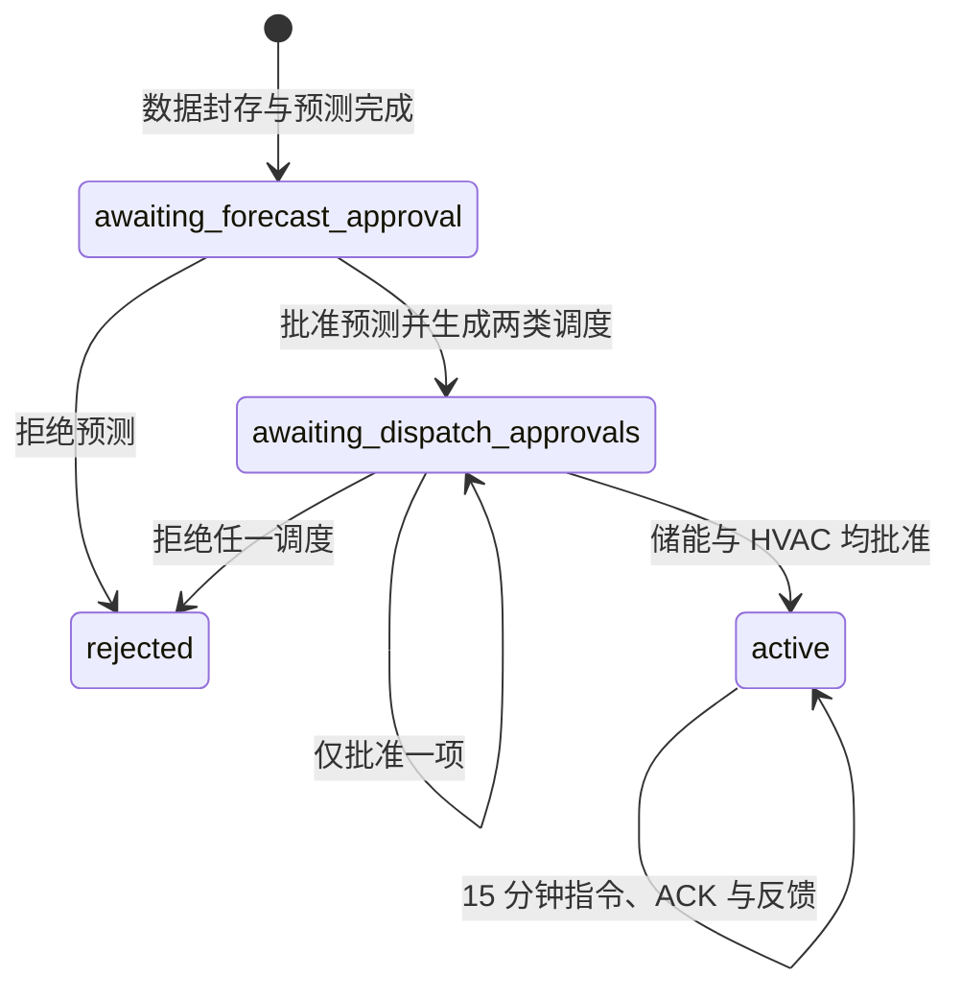

# 系统架构与安全状态机

## 四层架构

1. 数据接入层：读取园区负荷、电价、湖南发电结构和设备台账；缺口以带 provenance 的工程模拟补全。
2. 确定性工具层：电价与需量核算、电碳因子、储能 MILP、HVAC 调度、空压机能力评估。
3. LangGraph 协同层：Data、Prediction、Storage、HVAC、Monitor 五类 Agent 通过结构化状态传递结果。
4. 人机执行层：工程师审批、模拟执行器、ACK、测量反馈、偏差与物理边界监察。

## 工作流状态

安全不变量：

- `pending_approval` 和 `rejected` 不得产生物理执行命令。
- 调度命令绑定储能/HVAC 报告的 `report_id` 与 SHA-256 哈希。
- 人工覆盖只能在对应系统调度已批准后受理，并在下一仿真步执行。
- SOC、温度、供水温度、COP、负荷边界和执行偏差由 Monitor Agent 检查。
- reset 在同一状态锁内重置时间、累计值、序列、计划、命令和审批状态。

## 持久化

`backend/data/archive/<sim_date>/<run_id>/` 按运行归档：

- `reports/`、`approvals/`、`workflow/`
- `commands/`、`acks/`、`feedback/`
- `control_actions/`
- `realtime.csv`

归档采用追加式事件文件和原子替换，适合当前小数据量演示。接入真实 BAS/BMS/PLC 前，应将模拟执行器替换为设备适配器，并保留相同的命令/ACK 接口。
