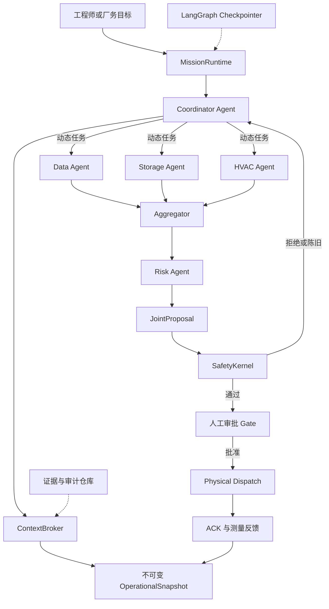
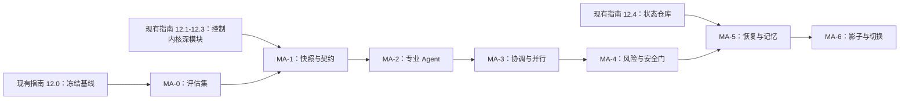

# v3 受控多 Agent 改造执行路线（历史参考）

> 文档状态：**内容已合并，不再作为执行基线**  
> 适用范围：`v3_energy_management`  
> 更新日期：2026-08-03  
> 唯一有效指南：[LangGraph 忠实化改造指南](20260803revise_guide.md)  
> 本文仅保留为治理方案形成过程的历史参考；如与唯一指南冲突，以唯一指南为准。

## 1. 决策与目标

### 1.1 架构决策

v3 不改造成“所有节点均由 LLM 自治”的系统，而改造成：

> **受控多 Agent 协同层 + 确定性能源控制内核。**

多 Agent 层负责理解目标、拆分任务、调用确定性分析工具、比较方案、识别冲突和生成候选建议；确定性内核继续负责数据处理、优化求解、物理约束、审批绑定、设备执行、ACK、反馈和审计。

第一版所有 Agent 均在同一 Python 进程内异步运行。逻辑独立不等于独立进程；只有出现独立扩缩容、权限隔离或故障隔离的真实需求后，才评估远程部署。

### 1.2 最终目标

改造完成后，系统必须具备以下能力：

1. Coordinator 根据厂务目标动态选择专业 Agent，而不是固定返回四条模板结论。
2. Data、Storage、HVAC 和 Risk Agent 拥有独立角色、工具权限、私有任务上下文和结构化输出。
3. 被选中的专业 Agent 基于同一个版本化运行快照并行分析。
4. Aggregator 能发现跨专业冲突，并触发有界的定向复核。
5. 所有 Agent 只能生成分析结果或候选方案，不能批准报告、应用扰动或发送物理命令。
6. 候选方案必须依次通过确定性 Safety Kernel 和人工审批，才能进入物理执行。
7. Agent 任务可以暂停、恢复和重放；进程重启后不会丢失待审批任务。
8. 每项结论可以追溯到输入快照、数据证据、工具调用、模型版本和人工决定。

### 1.3 非目标

本次改造明确不做以下事项：

- 不让 LLM 自行生成负荷曲线、储能功率、HVAC 设定值、节费金额或碳排结果。
- 不向 Agent 暴露 `APPROVE`、`CONTROL` 或修改安全阈值的工具。
- 不用 Agent 替代 MILP、HVAC 调度、负荷重采样、物理约束和设备执行器。
- 不在第一版把每个 Agent 拆成微服务或独立容器。
- 不把完整聊天记录复制到所有 Agent。
- 不把现有追加式审计归档直接当作可恢复运行状态。

## 2. 当前基线与关键差距

当前 v3 已具备 LangGraph 工作流、专业节点配置、确定性算法、GLM Function Calling、三道审批、模拟执行器和归档证据链，但尚不是真正的多 Agent 系统。

| 当前实现 | 事实 | 改造要求 |
|---|---|---|
| Agent 运行方式 | 所有节点处理函数绑定在同一个 `SimulationEngine` | 将 Agent 运行抽离为可独立测试的深模块 |
| Storage/HVAC | 执行图中仍为 `storage → hvac` 顺序调用 | 使用动态 fan-out/fan-in 并行执行 |
| `coordinate_agents()` | 同步读取共享状态并返回预设文字 | 改为创建任务、派发 Agent、收集结构化结果 |
| Agent LLM 上下文 | 每次只发送配置、任务和 facts，不保留任务历史 | 增加受控私有上下文和任务记忆 |
| 共享状态 | 大量可变数据存放在 `SimulationEngine` 成员变量 | 以不可变、版本化 `OperationalSnapshot` 作为 Agent 事实源 |
| LangGraph 持久化 | `graph.compile()` 未配置 checkpointer | 增加可恢复检查点和稳定 `thread_id` |
| Monitor | 同时承担语言解释和安全检查概念 | 拆为 `RiskAgent` 与确定性 `SafetyKernel` |
| 厂务聊天 | `session_id` 历史仅保存在进程内存 | 将聊天会话与 Agent mission 状态分离 |

本路线不替代 `20260803revise_guide.md`。其中“唯一工作流定义、日前并行、单 Tick 实时模块、状态仓库与恢复路径”是本路线的控制内核基础。

## 3. 方法论

### 3.1 先确定性、后自治

任何由确定性函数一次完成的任务继续保留为普通模块。只有同时具备“目标驱动、动态选择工具、需要多步分析、可能与其他专业意见冲突”的任务，才进入 Agent 循环。

判定规则：

```text
固定输入 → 固定算法 → 固定输出       = 确定性模块
目标 → 观察 → 选择工具 → 复核 → 输出 = Agent
```

### 3.2 深模块与清晰 seam

改造以深模块为单位进行：调用者通过少量 interface 获得完整行为，不需要理解提示词拼装、工具预算、重试、上下文裁剪和检查点细节。

核心 seam：

- Mission 编排 seam：启动、恢复、查询一个协同任务。
- Agent seam：执行一个结构化任务并返回结构化结果。
- Context seam：根据 Agent、任务和快照构建最小充分上下文。
- Safety seam：对联合方案进行确定性校验并返回硬性结论。
- State Repository seam：保存和恢复运行检查点。
- Model seam：隔离外部模型调用，生产使用 GLM Adapter，测试使用脚本化 Adapter。

interface 是测试面。测试应断言可观察结果和安全不变量，不依赖 Agent 内部提示词排列或私有节点顺序。

### 3.3 快照一致性

一次 mission 内的并行 Agent 必须读取同一个 `snapshot_id`。Agent 不得在任务运行中直接读取持续变化的 `SimulationEngine` 可变对象。

若提交方案时当前状态版本已变化，Safety Kernel 必须返回 `stale_snapshot`，由 Coordinator 基于新快照重新分析或请求人工决定。

### 3.4 契约优先

Agent 之间不依赖自由文本传递关键事实。任务、结果、证据、冲突、方案、安全结论和审批均使用 Pydantic 模型。

自然语言只用于面向人员的解释；机器决策只读取结构化字段。

### 3.5 最小权限

工具按 `READ`、`ANALYZE`、`PROPOSE`、`APPROVE`、`CONTROL` 分级。Agent 只允许前三类，并由 Tool Registry 同时校验 Agent 身份、人员角色、任务范围和参数。

### 3.6 影子验证与渐进切换

新旧路径必须在相同输入和快照下并行运行。多 Agent 路径在影子阶段只生成方案，不得发送物理命令。只有通过退出门后，才逐步替换现有模板化协调逻辑。

## 4. 目标架构



控制原则：

```text
Agent 可以建议什么
≠ Agent 可以批准什么
≠ Agent 可以执行什么
```

## 5. Agent 划分与职责

| 模块 | 形态 | 主要输入 | 主要输出 | 禁止事项 |
|---|---|---|---|---|
| Coordinator | Agent | 用户目标、快照摘要、可用 Agent 清单 | 任务计划、选中 Agent、汇总请求 | 不生成算法数值、不执行控制 |
| Data Agent | 只读 Agent | 数据血缘、粒度、缺失率、异常点 | 数据质量结论、证据、阻塞项 | 不修改原始数据、不伪造实测值 |
| Prediction | 确定性模块 | 实测负荷、源粒度 | 校验与能量守恒重采样结果 | 无真实预测模型前不得宣称预测未来 |
| Storage Agent | 分析 Agent | 快照、储能约束、优化工具 | 候选储能策略、风险、证据 | 不直接写入计划、不发送功率指令 |
| HVAC Agent | 分析 Agent | 快照、冷机台账、HVAC 工具 | 候选 HVAC 策略、容量风险、证据 | 不直接修改温度设定、不发送命令 |
| Aggregator | 确定性优先的深模块 | 多个 `AgentResult` | 冲突清单、联合候选方案 | 不掩盖冲突、不凭文本选择数值 |
| Risk Agent | 审查 Agent | 联合方案、Agent 结果、历史偏差 | 风险解释、复核建议、缺失证据 | 不拥有硬安全否决的唯一来源 |
| Safety Kernel | 确定性模块 | 联合方案、当前快照、审批绑定 | `pass/reject/stale` 和违规项 | 不调用 LLM，不允许软化硬约束 |
| Physical Dispatch | 确定性模块 | 已审批且绑定有效的命令 | 命令、ACK、反馈 | 不接受 Agent 自由文本作为命令 |

第一版不单独建立 Prediction Agent。等接入版本化预测模型、回测指标和模型选择能力后，再评估是否升级为独立 Agent。

## 6. 核心 interface 与数据契约

### 6.1 MissionRuntime

对聊天层和其他调用者只暴露三个 interface：

```python
start(goal, actor, role, session_id) -> MissionResult
resume(mission_id, human_input) -> MissionResult
get(mission_id) -> MissionView
```

必须保证：

- `start()` 创建唯一 `mission_id`，绑定创建时的 `snapshot_id`。
- `resume()` 只能恢复处于可恢复状态的 mission。
- 同一个人工决定重复提交时保持幂等。
- 达到预算、等待人工、失败或完成时均返回明确 `stop_reason`。

### 6.2 Agent

```python
class EnergyAgent(Protocol):
    async def run(
        self,
        task: AgentTask,
        context: AgentContext,
    ) -> AgentResult: ...
```

调用者只需要理解任务、上下文和结果。工具选择、重试、提示词、模型交互和预算控制隐藏在 Agent 模块内部。

### 6.3 ContextBroker

```python
build(agent_id, task, snapshot_ref) -> AgentContext
```

必须保证：

- 只返回该 Agent 完成任务所需的最小数据切片。
- 上下文中所有事实均带来源或 `snapshot_id`。
- 不返回 API Key、系统凭据、无关聊天或其他 Agent 私有记忆。
- 超出 token 预算时优先保留政策、任务、约束和证据，删除重复叙述。

### 6.4 SafetyKernel

```python
validate(proposal, current_snapshot_ref) -> SafetyVerdict
```

返回值至少包含：

```python
class SafetyVerdict(BaseModel):
    status: Literal["pass", "reject", "stale_snapshot"]
    violations: list[ConstraintViolation]
    required_approvals: list[str]
    validated_snapshot_id: str
```

任何异常、缺失字段、版本不兼容或快照陈旧均采用 fail-closed，不得默认通过。

### 6.5 最小数据模型

```python
class AgentTask(BaseModel):
    task_id: str
    mission_id: str
    objective: str
    snapshot_ref: str
    required_outputs: list[str]
    allowed_tools: list[str]
    deadline_seconds: int


class AgentResult(BaseModel):
    task_id: str
    agent_id: str
    status: Literal["completed", "blocked", "failed"]
    findings: list[Finding]
    recommendations: list[ProposedAction]
    evidence_refs: list[str]
    assumptions: list[str]
    risks: list[str]
    confidence: float


class JointProposal(BaseModel):
    mission_id: str
    snapshot_id: str
    proposed_actions: list[ProposedAction]
    source_task_ids: list[str]
    conflicts: list[AgentConflict]
    required_approvals: list[str]
```

`ProposedAction` 必须使用枚举化动作类型和结构化参数，禁止将“把储能功率调高一点”之类的文本直接转换为物理命令。

## 7. 上下文与记忆策略

### 7.1 标识符分工

| 标识符 | 含义 | 生命周期 |
|---|---|---|
| `session_id` | 人与系统的聊天会话 | 可跨多个 mission |
| `mission_id` | 一次目标驱动的多 Agent 协作任务 | 从目标创建到完成/取消 |
| `run_id` | 一轮日前计划或实时执行运行 | 与审批和执行证据绑定 |
| `snapshot_id` | 某一时刻不可变的系统事实版本 | 永久可追溯 |
| `task_id` | Coordinator 派给一个 Agent 的任务 | 单次 Agent 执行或复核 |

不得继续用 `session_id` 同时承担协作状态、运行状态和设备执行状态。

### 7.2 五层上下文

每个 Agent 的上下文按以下顺序构建：

1. **固定政策**：角色、权限、禁止事项、输出 Schema。
2. **任务包**：目标、完成条件、允许工具、预算和截止条件。
3. **共享事实**：同一 `snapshot_id` 下与该专业相关的数据切片。
4. **私有任务记忆**：该 Agent 最近的任务—结果—人工反馈摘要。
5. **协作输入**：Coordinator 明确转交的其他 Agent 结果或冲突，不默认广播全部内容。

### 7.3 记忆写入规则

允许写入长期 Agent 记忆的内容：

- 经确认的稳定设备事实；
- 已执行方案的实际反馈；
- 明确的人工审批意见；
- 重复出现的失败模式及修正结果。

不得写入：

- 未审批候选方案；
- 模型自己的推测；
- API Key、令牌和个人隐私；
- 可从快照重新读取的大型时间序列；
- 完整原始聊天副本。

任务结束时先形成结构化摘要，再决定是否写入；不能把每轮模型消息无限追加为长期记忆。

## 8. LangGraph 编排设计

### 8.1 MissionState

图状态只保存协作控制信息和大型制品引用：

```python
class MissionState(TypedDict, total=False):
    mission_id: str
    session_id: str
    objective: str
    snapshot_ref: str
    task_plan: list[dict]
    agent_results: Annotated[list[dict], add_agent_results]
    conflicts: list[dict]
    joint_proposal: dict | None
    safety_verdict: dict | None
    human_decision: dict | None
    execution_ref: str | None
    status: str
    stop_reason: str | None
    events: Annotated[list[dict], add_events]
```

负荷曲线、设备台账、完整报告和工具轨迹放在制品仓库，通过引用读取，不复制到每个图节点。

### 8.2 执行图

```text
START
→ capture_snapshot
→ coordinator_plan
→ dynamic fan-out: selected specialist agents
→ aggregate_results
→ [存在可解决冲突] targeted_review（最多一轮）
→ risk_review
→ safety_validate
→ [reject/stale] replan 或安全结束
→ [pass] interrupt: human approval
→ [approve] proposal_to_existing_control_workflow
→ verify_feedback
→ END
```

约束：

- 专业 Agent 的 fan-out 使用不同 `task_id`，结果通过 reducer 合并。
- 任一专业 Agent 不得直接覆盖其他 Agent 的结果。
- 第一版冲突复核最多一轮，整个 mission 最多 8 个模型步骤、16 次工具调用、120 秒。
- 任何 `PROPOSE` 结果均在人工审批前暂停。
- LangGraph `thread_id` 使用 `mission_id`，不得使用模糊的默认聊天 ID。

## 9. 工具权限矩阵

| 工具类别 | Coordinator | Data | Storage | HVAC | Risk |
|---|---:|---:|---:|---:|---:|
| 读取系统快照 | 摘要 | 数据切片 | 储能切片 | HVAC 切片 | 必要全局切片 |
| 读取报告/审批/ACK | 是 | 血缘相关 | 储能相关 | HVAC 相关 | 是 |
| 数据质量分析 | 可派发 | 是 | 否 | 否 | 读取结果 |
| 储能情景优化 | 可派发 | 否 | 是 | 否 | 读取结果 |
| HVAC 情景优化 | 可派发 | 否 | 否 | 是 | 读取结果 |
| 约束预检查 | 可派发 | 数据规则 | 储能规则 | HVAC 规则 | 跨域规则 |
| 创建候选方案 | 汇总 | 仅数据建议 | 是 | 是 | 仅修订建议 |
| 应用扰动 | 否 | 否 | 否 | 否 | 否 |
| 审批 | 否 | 否 | 否 | 否 | 否 |
| 物理控制 | 否 | 否 | 否 | 否 | 否 |

Tool Registry 必须拒绝未登记工具、越权参数、超预算调用和重复调用。权限校验在执行工具前完成，不能依赖模型遵守提示词。

## 10. 可执行实施路径

### MA-0：冻结基线与建立评估集

**目标**：证明后续变化提升的是协作能力，而不是破坏现有能源控制语义。

**前置条件**：执行 `20260803revise_guide.md` 阶段 12.0 的安全不变量测试。

**实施方法**：

1. 固定至少 12 个代表性目标：高负荷、冷机故障、储能高温、SOC不足、电价突变、数据缺失、审批停滞、ACK失败等。
2. 保存当前 `coordinate_agents()` 的输出作为对照基线。
3. 为每个目标标注应选 Agent、必要工具、必须发现的风险、禁止提出的动作和期望停止状态。
4. 增加模型不可用、超时、工具失败和提示注入样本。

**主要产物**：

- `backend/tests/fixtures/multi_agent_scenarios/`；
- `backend/tests/test_multi_agent_baseline.py`；
- 安全不变量与当前行为基准报告。

**退出门**：评估集可重复运行；所有场景都有机器可判定的必选项、禁止项和安全结果。

### MA-1：建立快照、任务和结果契约

**目标**：切断 Agent 对 `SimulationEngine` 可变内部状态的直接依赖。

**实施方法**：

1. 新增 `OperationalSnapshot`，由 Engine 在锁内一次性生成。
2. 快照包含 `snapshot_id`、`as_of`、`schema_version`、数据血缘和必要状态，不包含可调用方法。
3. 新增 `AgentTask`、`AgentResult`、`JointProposal`、`SafetyVerdict`。
4. 实现 `ContextBroker.build()`，按 Agent 白名单裁剪快照。
5. 第一阶段只读，不改变现有工作流输出。

**建议文件**：

```text
backend/src/domain/snapshots.py
backend/src/collaboration/contracts.py
backend/src/collaboration/context_broker.py
backend/tests/test_context_broker.py
backend/tests/test_multi_agent_contracts.py
```

**必须测试**：

- 同一次捕获只生成一个一致快照；
- Agent 看不到未授权字段；
- 快照生成后不受 Engine 后续变化影响；
- 所有结果必须包含证据引用和 `snapshot_id`；
- Schema 版本不兼容时明确拒绝。

**退出门**：专业分析可以只依赖 `AgentTask + AgentContext` 完成；测试不再需要读取 Engine 私有成员。

### MA-2：实现专业 Agent 深模块

**目标**：用真实工具调用替代模板化专业结论。

**实施方法**：

1. 先实现 Data、Storage、HVAC 三个 Agent，统一满足 `EnergyAgent.run()` interface。
2. 将现有负荷处理、储能优化、HVAC 优化包装为只读或隔离情景 `ANALYZE` 工具。
3. 每个 Agent 使用独立角色政策、工具白名单、步数预算和输出 Schema。
4. 生产使用 GLM Model Adapter；测试使用脚本化 Model Adapter。
5. Agent 失败返回 `blocked/failed`，不得在异常时伪造 completed 结果。

**建议文件**：

```text
backend/src/agents/base.py
backend/src/agents/data_agent.py
backend/src/agents/storage_agent.py
backend/src/agents/hvac_agent.py
backend/src/collaboration/tool_registry.py
backend/src/adapters/glm_model.py
backend/src/adapters/scripted_model.py
```

**必须测试**：

- 每个 Agent 只能调用白名单工具；
- Agent 输出符合 Schema；
- 工具数值与确定性算法原始结果一致；
- GLM 不可用时返回明确降级结果；
- 任何 Agent 都无法获得审批或控制工具。

**退出门**：三个 Agent 在评估集上独立产出带证据结果，且不会改变系统运行状态。

### MA-3：实现 Coordinator、并行派发与汇总

**目标**：形成真正的动态多 Agent 协作，而不是固定调用全部角色。

**实施方法**：

1. Coordinator 根据目标输出结构化 `task_plan`，包含选中 Agent、目标、必需输出和工具预算。
2. 使用 LangGraph 动态 fan-out 派发选中的 Agent。
3. reducer 按 `task_id` 收集结果，禁止覆盖。
4. Aggregator 先用确定性规则检查单位、时间范围、快照版本和动作冲突，再生成联合方案。
5. 可解决冲突时仅向相关 Agent 发起一次定向复核；不可解决时返回人工待办。
6. 保留旧 `coordinate_agents()` 作为 feature flag 下的回退路径，不能长期双写。

**建议文件**：

```text
backend/src/collaboration/coordinator.py
backend/src/collaboration/aggregator.py
backend/src/workflows/mission.py
backend/tests/test_mission_workflow.py
```

**必须测试**：

- 不相关 Agent 不被派发；
- Storage 与 HVAC 无顺序依赖；
- 单 Agent 超时不会丢失其他结果；
- 冲突能够触发定向复核或人工待办；
- 不同快照结果不能合并；
- 重复 `task_id` 不会产生双重结果。

**退出门**：至少 80% 评估场景选择正确 Agent；并行结果可重复汇总；任何冲突均不会静默进入候选方案。

### MA-4：拆分 Risk Agent 与 Safety Kernel

**目标**：同时获得跨专业风险解释和不可绕过的确定性安全门。

**实施方法**：

1. Risk Agent 阅读联合方案、专业证据和历史偏差，输出风险与复核建议。
2. 从现有 Monitor/Engine 中提取确定性硬约束到 `SafetyKernel`。
3. Safety Kernel 校验 SOC、温度、功率、爬坡、COP、冷机可用数、报告绑定、审批要求和快照新鲜度。
4. Risk Agent 的“低风险”结论不能覆盖 Safety Kernel 的拒绝。
5. Safety 通过后使用 LangGraph interrupt 等待人工审批。

**建议文件**：

```text
backend/src/agents/risk_agent.py
backend/src/domain/safety.py
backend/src/workflows/mission.py
backend/tests/test_safety_kernel.py
backend/tests/test_agent_authorization.py
```

**必须测试**：

- 提示注入不能绕过硬约束；
- 陈旧快照必须拒绝；
- Risk Agent 与 Safety Kernel 意见不一致时以 Safety Kernel 为准；
- 未人工审批不得进入现有控制工作流；
- 缺字段、异常和超时均 fail-closed。

**退出门**：所有候选方案必须经过 Risk、Safety、Human 三段式门控；不存在从 Agent 结果直达执行器的路径。

### MA-5：持久化、暂停恢复与任务记忆

**目标**：让多 Agent mission 在重启、人工等待和外部故障后可恢复。

**前置条件**：完成 `20260803revise_guide.md` 阶段 12.4 的状态仓库 seam，或与其共同实施。

**实施方法**：

1. 开发环境接入 SQLite checkpointer；部署环境使用 PostgreSQL 或经过验证的持久化 Adapter。
2. LangGraph `thread_id = mission_id`。
3. 保存当前节点、任务计划、Agent 结果引用、工具轨迹、预算、暂停原因和人工决定。
4. Agent 私有记忆只保存结构化摘要，并关联 `agent_id + site_id`。
5. 审计归档继续追加不可变事件；检查点负责恢复，二者职责不得混合。

**建议文件**：

```text
backend/src/repositories/mission_repository.py
backend/src/repositories/agent_memory_repository.py
backend/src/adapters/sqlite_checkpoint.py
backend/tests/test_mission_recovery.py
```

**必须测试**：

- 重启后恢复待审批 mission；
- 已完成工具调用不会重复产生副作用；
- 损坏检查点 fail-closed；
- 会话历史、mission 状态、run 状态互不混淆；
- 取消的 mission 不可继续执行。

**退出门**：进程重启后可以从最后安全检查点恢复，且不会重复提案、审批或命令。

### MA-6：影子评估、灰度切换与旧路径清理

**目标**：证明多 Agent 路径比模板化协调更有价值，并安全成为唯一协同路径。

**实施方法**：

1. 使用 feature flag：`template`、`shadow_multi_agent`、`multi_agent`。
2. 影子模式下新旧路径读取同一快照；新路径禁止进入物理执行。
3. 比较 Agent 选择准确率、必要风险召回率、禁用动作发生率、工具失败恢复率、延迟和模型成本。
4. 先向内部工程师开放，再向厂务角色开放。
5. 达到退出门后删除模板化 `coordinate_agents()`；不得永久维护两套协同实现。
6. 更新 `ARCHITECTURE.md`、前端 Agent Flow 和运维文档。

**验收阈值**：

- 必要专业 Agent 召回率 ≥ 95%；
- 关键风险召回率 = 100%；
- 未授权工具执行次数 = 0；
- 未经 Safety 和人工审批进入控制路径次数 = 0；
- 快照混用次数 = 0；
- 重启恢复场景通过率 = 100%；
- 相比模板基线，对复合目标的有效结论覆盖率有明确提升。

**退出门**：多 Agent 路径通过全量回归、影子评估和人工验收，旧模板路径已删除，文档与前端展示真实执行图。

## 11. 阶段依赖与实施顺序



不得跳过的顺序：

1. 没有版本化快照，不开始并行 Agent。
2. 没有结构化结果，不实现 Aggregator。
3. 没有 Safety Kernel，不允许产生可审批的联合方案。
4. 没有检查点，不开放需要人工等待的长任务。
5. 没有影子评估，不删除旧路径或切换默认行为。

## 12. 测试策略

测试以模块 interface 为测试面，按四层组织：

### 12.1 契约测试

- Pydantic Schema、版本、枚举和必填证据；
- 快照不可变性和 ContextBroker 字段白名单；
- Tool Registry 权限矩阵；
- Checkpointer Adapter 一致性。

### 12.2 Agent 行为测试

- 使用脚本化 Model Adapter，不依赖真实 GLM；
- 验证 Agent 的工具选择、预算、停止原因和输出 Schema；
- 验证恶意提示不能扩展工具权限；
- 验证 GLM 超时和错误时的降级状态。

### 12.3 工作流测试

- 动态路由、并行合并、Agent 超时、定向复核；
- interrupt、人工恢复和重复提交幂等；
- stale snapshot、冲突和 Safety 拒绝路径；
- 重启恢复与取消路径。

### 12.4 端到端安全测试

- 未审批不得执行；
- Agent 不得调用控制工具；
- 旧快照和旧报告绑定不得执行；
- 已 ACK 的命令不得重复执行；
- 影子模式不得产生物理副作用；
- 模型不可用时确定性控制内核继续运行。

## 13. 可观测性与审计

每个 mission 至少记录：

- `mission_id/session_id/run_id/snapshot_id`；
- Coordinator 任务计划及选择理由；
- 每个 Agent 的输入制品引用、模型、提示版本和 token/时间预算；
- 工具名称、参数摘要、结果引用、耗时和错误；
- AgentResult、冲突、定向复核和 Aggregator 决定；
- Risk 结果、SafetyVerdict、人工决定；
- 最终是否进入控制工作流以及对应执行证据。

日志中不得记录 API Key、完整凭据或未经脱敏的敏感输入。

建议指标：

- mission 完成率、阻塞率、失败率；
- Agent 选择准确率；
- 每类工具成功率与 P95 耗时；
- 冲突率、复核率、Safety 拒绝率；
- stale snapshot 率；
- 人工批准/修订/拒绝比例；
- 单 mission 模型调用次数、token 和成本；
- Agent 建议与实际执行反馈偏差。

## 14. 风险与控制措施

| 风险 | 后果 | 控制措施 |
|---|---|---|
| LLM 编造数值 | 错误方案 | 数值只能来自确定性工具；Schema 要求 evidence refs |
| Agent 读取不同时间状态 | 联合方案不一致 | mission 固定 `snapshot_id`；提交前检查新鲜度 |
| Agent 意见冲突 | 方案无法执行或互相抵消 | Aggregator 显式冲突模型；有界复核；人工待办 |
| 提示注入越权 | 绕过审批或控制 | Tool Registry 代码级权限；不注册 APPROVE/CONTROL |
| 多轮循环失控 | 高延迟和高成本 | 步数、工具数、重复、时间和费用预算 |
| 进程重启丢状态 | 重复提案或失去审批位置 | Checkpointer、幂等键和恢复测试 |
| 过早拆成微服务 | 运维复杂度大于收益 | 第一版进程内运行；有真实第二 Adapter 需求后再建远程 seam |
| 双路径长期存在 | 状态与行为漂移 | feature flag 仅用于迁移；MA-6 后删除旧路径 |

## 15. 回退策略

每个阶段必须保持以下回退能力：

1. 多 Agent 路径通过 feature flag 关闭后，确定性日前、实时、审批和执行模块仍可独立运行。
2. 影子模式永远不产生物理副作用。
3. 新 Schema 写入前携带 `schema_version`，不兼容时拒绝读取而不是猜测迁移。
4. 切换期间保留最近一个已验证版本的检查点 Adapter 和数据库迁移回退脚本。
5. Safety Kernel、审批绑定和执行器不得受多 Agent feature flag 影响。

出现以下任一情况必须关闭多 Agent 默认路径：

- 未授权工具被执行；
- 未经 Safety 或人工审批进入控制路径；
- 快照混用；
- 重启导致重复副作用；
- 关键风险漏检；
- 模型错误导致确定性主流程不可用。

## 16. 完成定义

只有同时满足以下条件，才可声明“v3 已完成真正的受控多 Agent 改造”：

- [ ] Coordinator 能根据目标动态选择 Agent。
- [ ] 至少三个专业 Agent 通过统一 interface 独立运行。
- [ ] Storage 与 HVAC 可基于同一快照并行分析。
- [ ] 每个 Agent 拥有独立权限、上下文和结构化结果。
- [ ] Aggregator 能识别并处理跨 Agent 冲突。
- [ ] Risk Agent 与 Safety Kernel 已分离。
- [ ] 所有候选方案必须经过 Safety Kernel 和人工审批。
- [ ] Agent 无法访问 APPROVE 和 CONTROL 工具。
- [ ] mission 能暂停、重启恢复和幂等重放。
- [ ] 所有结论可追溯到快照、证据、工具和模型版本。
- [ ] 多 Agent 影子评估优于模板化基线。
- [ ] 旧 `coordinate_agents()` 模板路径已删除。
- [ ] 前端拓扑、后端执行图、文档和自动化测试一致。

最终系统职责应保持清晰：

```text
多 Agent：理解目标、收集证据、分析、协商、提出候选方案
状态机：路由、暂停、恢复、审批、版本绑定和审计
确定性内核：计算、约束、安全校验和物理执行
人员：批准、修订或拒绝高影响决策
```
