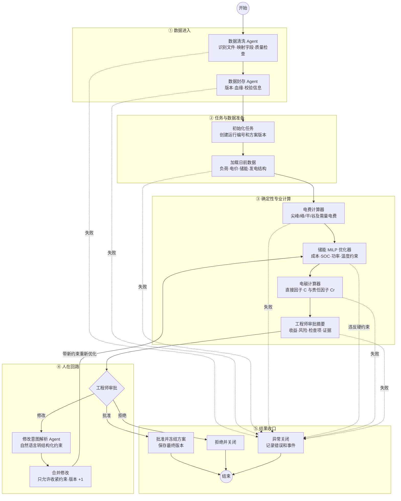
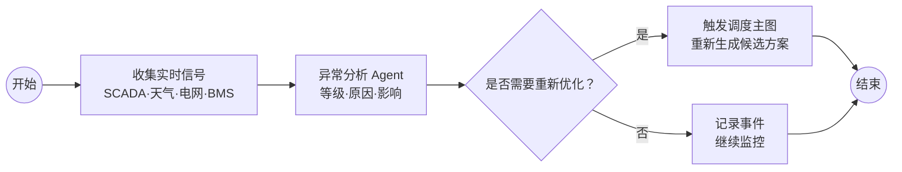
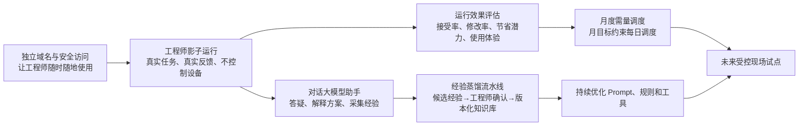
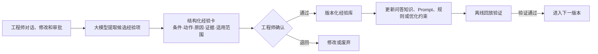
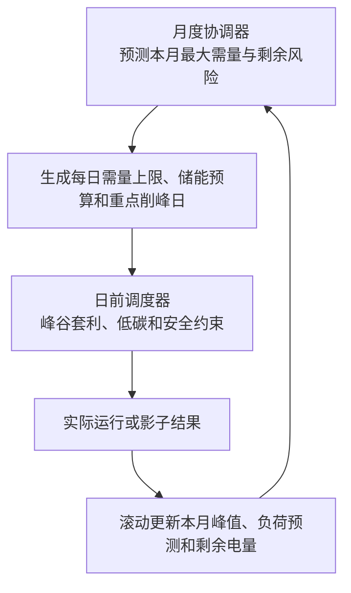

# 碳中和实践项目现状与汇报框架


## 一、先说结论

项目已经完成一个**可演示、可计算、可审查的工程原型**：系统可以读取园区能源数据，识别电价和用能特征，用数学模型生成储能调度候选方案，再交由工程师审批、修改并留痕。

## 二、为什么要做这个项目

黄花园区体量大、能源种类多，人工管理面临三个问题：

1. **数据多但分散**：负荷、电价、设备和生产数据来自不同表格和系统，统一分析成本高。
2. **优化问题复杂**：既要考虑峰谷电价和最大需量，也要兼顾储能安全、生产约束和碳排放。
3. **经验难以沉淀**：工程师每天的判断、修改和审批通常散落在口头交流或表格中，难以复用。

因此，本项目不是做一个“会聊天的机器人”，而是建立一条可复核的能源决策流水线：

> 数据可信 → 算法给方案 → AI 做协调与解释 → 工程师审批 → 全过程留痕。

## 三、项目总体框架


| 层级 | 通俗解释 | 当前成果 |
|---|---|---|
| 1. 数据底座 | 把散落的表格和系统数据整理成统一账本 | 已完成第一轮数据盘点和质量审计 |
| 2. 专业计算 | 像“计算器和规划师”，负责电费、碳排和最优计划 | 已有电价计算、储能优化、电碳计算 |
| 3. AI 助手 | 像“项目经理”，理解人的要求并组织工具工作 | 已形成显式工作流和自然语言修改能力 |
| 4. 人工审批 | 工程师拥有最终决定权，可以收紧安全约束 | 已跑通批准、拒绝、修改后重算 |
| 5. 安全执行 | 批准后通过独立安全网关对接现场控制 | 尚未实施，属于后续现场阶段 |

这里最重要的设计原则是：**AI 不直接负责算数和安全边界。**电费、碳排、储能约束由可重复验证的算法计算；AI 只负责理解、组织和解释，避免“大模型说得像对的，但实际上算错了”。

### 现有 LangGraph 调度主图



现有主图包含 14 个节点，但不能把 14 个节点全部称为 Agent：

| 类别 | 现有节点 | 是否使用大模型 |
|---|---|---|
| 语义 Agent | 数据清洗、数据封存、修改意图解析 | 是；没有模型接口时可跳过或使用备用逻辑 |
| 确定性工具 | 电费计算、储能优化、电碳计算 | 否；由公式、优化器和硬约束执行 |
| 系统节点 | 初始化、加载数据、合并修改、冻结、拒绝、失败收口 | 否 |
| 人工节点 | 工程师审批 | 人拥有最终决定权 |

### 人工修改回路

```text
算法生成 V1 方案
    ↓
工程师查看收益、风险与安全检查
    ↓
提出自然语言修改意见
    ↓
Agent 解析并在必要时向工程师澄清
    ↓
系统把意见转换为更严格的计算约束
    ↓
重新优化形成 V2，再次提交审批
```


### 现有异常监控旁路（已实现）

异常监控没有塞进日前调度主图，而是作为一个独立 LangGraph 持续运行：



这种主图与监控图分离的设计，可以让异常分析持续进行，又不会让监控 Agent 绕过审批流程直接改变已批准方案。

### 现有 Agent 清单及位置

| Agent | 负责什么 | 所在位置 |
|---|---|---|
| DataIngestAgent | 文件识别、字段映射、数据质量判断 | 调度主图入口 |
| DataArchiveAgent | 数据封存、血缘和版本记录 | 调度主图入口 |
| RevisionParser | 将工程师修改意见转换为调度约束 | 主图人工修改分支 |
| AnomalyMonitorAgent | 分析异常并判断是否触发重算 | 独立监控图 |
| DistillationReviewAgent | 总结修改经验并提出 Prompt 改进建议 | 离线复盘，不在在线主图中 |

当前演示中的审批摘要仍由确定性备用逻辑生成；如果没有配置真实大模型接口，数据清洗和封存 Agent 会跳过，修改解析也会使用备用逻辑。因此，今晚应表述为“系统已经预留并实现 Agent 节点及运行接口”，不宜表述为“所有 Agent 已在真实模型下生产运行”。

## 四、当前已经有什么

### 4.1 数据与业务认识

- 已盘点 403 个 CSV 文件，其中变电站负荷文件约 400 个、259.16 MB。
- 数据覆盖 2025 年 5 月 1 日至 2026 年 5 月 31 日，共约 15.1 万条有效负荷记录。
- 已分析 2026 年 1—6 月实际电费账单：总用电约 3.94 亿 kWh，总电费约 2.68 亿元。
- 已厘清湖南实际电价是尖、峰、平、谷四档；电费优化的主战场是分时电量转移和最大需量控制。
- 已识别关键数据风险：部分负荷文件不是连续 15 分钟遥测；2026 年 2 月 19 日前后存在供电拓扑变化；冷机和空压机仍缺部分实时状态和工艺约束。

### 4.2 平台底座

早期能源管理平台已经搭建：

- 25 张数据库表，覆盖组织、计量、碳排、调度和 Agent 留痕；
- 7 个业务接口域；
- 能源计量模块和合成数据生成器可运行；
- 组织、碳排和调度等部分仍是骨架，尚未全部完成业务实现。

这一层解决的是“平台应该怎样长期建设”的问题，当前主要价值是数据库和接口框架。

### 4.3 当前主成果：V2.2 能源调度原型

当前真正用于演示的是 V2.2 原型，已经具备：

- 15 分钟粒度、全天 96 个时点的调度计算；
- 尖峰/峰/平/谷四档电价和月度需量电费分离；
- 储能充放电优化，并约束 SOC、功率、爬坡和温度；
- 直接电碳因子与动态责任因子两套结果；
- 工程师批准、拒绝、自然语言修改后重新计算；
- 每日运行入口、数据采集接口和试运行经验导出接口；
- 单文件离线可视化控制台，无需互联网即可展示。

### 4.4 三个已跑通的演示案例

> 下列金额和减排量用于验证流程和算法，部分输入为合成数据，不能直接作为园区实际收益承诺。

| 案例 | 说明 | 演示结果 |
|---|---|---|
| 案例 1：经济调度 | 以降低电度电费为目标 | 候选方案显示日电度电费节省约 8,208 元；同时提示经济最优不一定减碳 |
| 案例 2：低碳调度 | 以低碳时段用电为目标，并允许人工修订 | 修订后日电度电费节省约 2,488 元，直接碳减排约 145 kg |
| 案例 3：人机协同 | 工程师提出“SOC 提高到 0.3，夜间不要放电” | 系统澄清时段、重新优化并生成 V2 方案，日电度电费节省约 4,586 元 |

三个案例都完成了“生成方案—人工审批—方案冻结”的闭环。案例 3 最能体现项目特色：AI 不是替代工程师，而是把工程师的自然语言要求转成可计算约束。

## 五、目前做到哪一步

| 状态 | 内容 |
|---|---|
| 🟢 已完成 | 数据盘点、电价结构分析、储能优化、电碳计算、人机审批闭环、三类案例、离线控制台 |
| 🟡 正在从原型转向试运行 | 独立域名与账号体系、真实数据接口、工程师影子运行、对话大模型 |
| 🟡 需要继续完善 | 工程经验蒸馏、月度需量调度、电池衰减成本、边际碳因子对照、真实设备约束 |
| 🔴 尚未进入 | 无人值守自动控制、现场指令下发、生产级部署与长期效益验收 |

### 工程验证的真实情况（内部口径）

- 控制台此前经过能源、运维和可视化三个视角的三轮评审，最终均给出通过；页面交互、图表单位和离线运行也做过验证。
- 代码库当前共有 46 项自动测试。本次复核为 44 项通过；1 项是排放因子版本修正后测试标签尚未同步，另 1 项受本机临时目录写入权限影响。它们不影响今晚的静态演示，但正式交付前应关闭。
- 当前演示中的 AI 摘要使用确定性备用模式，真实大模型接口尚未作为生产能力验收。

## 六、项目的边界与风险


### 6.1 现有储能对园区总负荷的削峰能力有限

演示储能功率约 5 MW，而园区负荷约 110—120 MW，因此它适合峰谷套利，但对园区总峰值的压降有限。若要显著降低最大需量，需要进一步联动冷机、空压机等柔性负荷。

### 6.3 “责任碳”不是官方物理减排量

动态责任因子用于引导用户把负荷移到低碳时段，是一种激励信号；它不能直接替代企业碳核算、碳交易或产品碳足迹中的官方排放量。但是分时碳计量是未来的趋势；

### 6.4 当前数据不足以支持无人控制

冷机和空压机缺少部分实时功率、压力、温度、流量、启停状态和工艺边界。数据补齐前，系统只能做分析和建议，不能承诺设备可中断容量，更不能直接控制。

## 七、下一阶段建议

未来规划的目标不是简单增加功能，而是形成一个**工程师随时可用、使用过程可评价、专业经验可沉淀、月度收益可验证**的长期系统。



### 规划 1：创建独立域名，实现随时随地访问（建议第 1—2 周）

将当前本地单文件控制台升级为有独立域名的 Web 系统，使授权工程师可以通过电脑或手机访问。域名只是入口，真正需要同步建设的是：

- HTTPS 加密、工程师账号、角色权限和登录审计；
- 前端展示服务与调度计算服务分离；
- 数据库、运行日志、方案版本和对话记录备份；
- 对外访问区与现场控制区隔离，互联网入口不能直接连通 PLC/BMS/EMS；
- 系统异常时保留本地离线和确定性备用模式。

阶段交付物：一个可通过独立域名访问的测试环境，以及账号、权限、日志和备份机制。

### 规划 2：邀请实际工程师开展影子运行（建议第 2—6 周）

影子运行期间，系统使用真实数据、每天生成真实候选方案，但**不自动下发设备**。工程师照常工作，同时查看系统建议并给出批准、拒绝或修改意见。

至少记录以下指标：

| 维度 | 建议指标 |
|---|---|
| 使用体验 | 登录与响应时间、任务完成时间、答疑是否有用、主观满意度 |
| 方案质量 | 方案接受率、人工修改率、拒绝原因、约束遗漏次数 |
| 经济效果 | 仿真节省金额、最大需量变化、储能衰减后净收益 |
| 安全可靠 | 硬约束违规率、数据异常率、系统失败和备用模式次数 |
| 人机协同 | 工程师提问类型、澄清轮数、经验项产出和确认率 |

影子运行建议至少覆盖一个完整计费月，才能同时评价日内峰谷套利和月度最大需量。

### 规划 3：上线可单独对话的工程师大模型助手（建议第 2—6 周）

除了现有调度流程中的 Agent，还需要一个工程师可以随时打开的独立对话入口。它承担三类任务：

1. **答疑**：解释电价、负荷、储能、碳因子、方案约束和异常原因；
2. **协助操作**：帮助工程师查询数据、比较方案、生成日报和提出修改；
3. **采集经验**：识别工程师在对话中给出的规则、例外、判断依据和现场知识。

该对话助手必须连接经过授权的园区数据、操作规程、设备说明和历史方案，并在回答中给出数据时间、来源和证据。它不能绕过 LangGraph、优化器和人工审批直接下发控制命令。

### 规划 4：建立工程师经验蒸馏闭环（建议第 3—8 周）

不能把所有聊天记录直接当作正确经验写进系统。建议采用五步蒸馏机制：



每条经验项至少包含：触发条件、建议动作、原因、证据来源、适用设备/时段、提出人、确认人、有效期和版本。只有经过工程师确认、离线回放验证的经验，才能进入正式知识库或调度规则。

### 规划 5：加入月度调度，降低最大需量电费（建议第 4—8 周）

当前系统主要优化一天内的峰谷电度电费，但园区基本电费按月最大需量计算。只做日调度容易出现“每天都省了一点电度电费，却在某一个时刻创造了新的月度峰值”的问题。

建议增加“月调度管日调度”的双层架构：



月度协调器需要：

- 维护当月已经出现的最大需量和计费规则；
- 预测未来 7—30 天可能出现的负荷峰值；
- 为每天设置需量上限、储能能量预算和重点削峰时段；
- 避免储能为了短期套利在真正的月度峰值到来前耗尽；
- 同时计算电度电费节省、需量电费节省和电池衰减成本，输出净收益。

### 规划 6：从影子运行进入受控现场试点（建议第 8 周以后）

- 优先从储能开始，再评估空压机或冷机；
- 通过独立安全网关与现有 EMS/BMS/PLC 对接；
- 先做受控小范围执行，不直接进入无人值守；
- 形成可复现的项目评估报告或论文案例。

### 其他

- 故障自诊断，自进化
- 近期、中期、远期场景（分时电价、实时电价等）

### 推荐推进顺序

> 独立域名和账号安全 → 真实工程师影子运行 → 对话助手采集反馈 → 经验蒸馏与验证 → 月度需量调度 → 受控现场试点。
